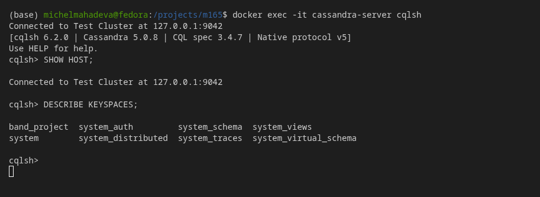
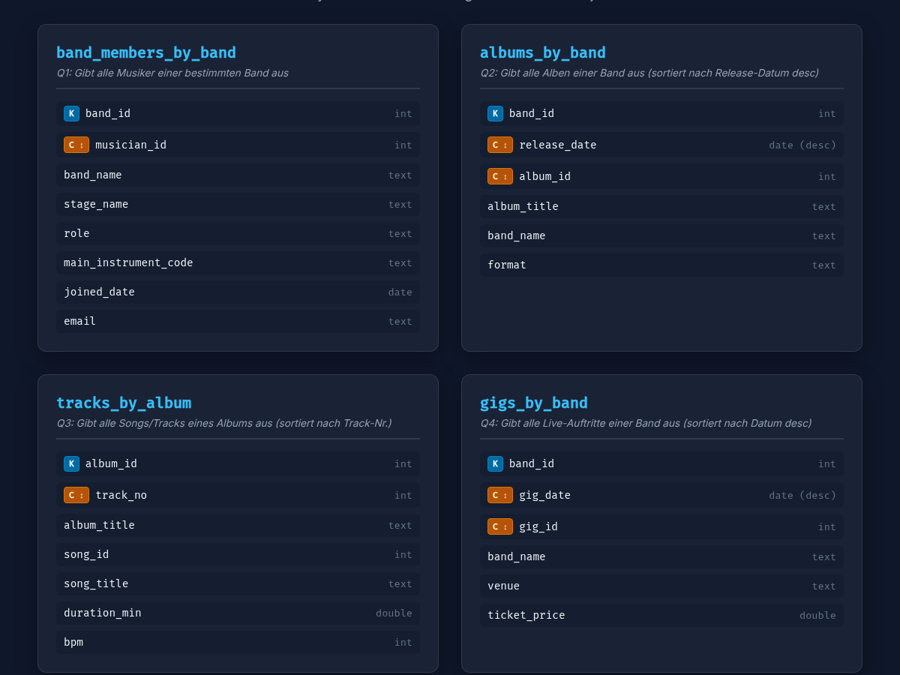
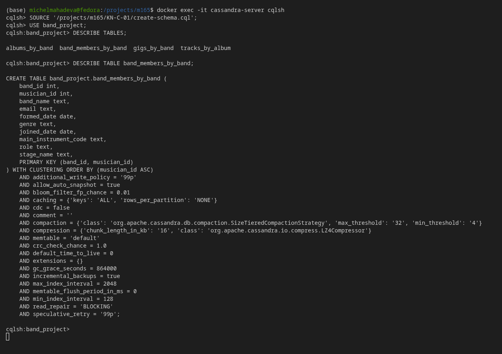

# KN-C-01: Installation und Datenmodellierung für Cassandra

**Thema:** Music band · **Keyspace:** `band_project`

---

## A) Installation / Verbindungstest (10%)

Die Cassandra-Datenbank wurde erfolgreich als Docker-Container auf der lokalen Instanz eingerichtet und gestartet. Für die Verwaltung und Ausführung von Befehlen wird das Command-Line-Tool `cqlsh` verwendet.

### Screenshot: Erfolgreicher Verbindungstest via `cqlsh`

---

## Theorie: Connection Strings und Authentifizierung

### Funktionsweise der Authentifizierung in Cassandra
Standardmässig nutzt Apache Cassandra den `PasswordAuthenticator` (konfiguriert in `cassandra.yaml`), um Benutzer zu verifizieren. 
* **Zentraler Speicher:** Sämtliche Benutzer, Rollen und Berechtigungen werden global im systemeigenen Keyspace `system_auth` (in Tabellen wie `system_auth.roles`) gespeichert.
* **Globale Gültigkeit:** Die Authentifizierung erfolgt beim Verbindungsaufbau auf Cluster- bzw. Protokollebene. Ein Benutzer meldet sich am gesamten Cluster an und hat – je nach zugewiesenen Berechtigungen – Zugriff auf verschiedene Keyspaces.

### Vergleich mit MongoDB (`authSource=admin`)
In MongoDB sind Benutzerkonten an spezifische Datenbanken gebunden.
* **MongoDB `authSource`:** Parameter wie `authSource=admin` legen fest, in welcher Datenbank MongoDB nach den Credentials (Benutzername/Passwort) suchen muss. Wird `authSource` weggelassen, sucht MongoDB den Benutzer standardmässig in der Zieldatenbank der Verbindung, was bei administrativen Konten (die in `admin` liegen) zu Authentifizierungsfehlern führt.
* **Cassandra:** Cassandra kennt kein Konzept wie `authSource`. Da Rollen und Anmeldedaten global in `system_auth` liegen, ist die Authentifizierung unabhängig vom aktuell verwendeten Keyspace. Nach erfolgreichem Login wechselt man einfach mit dem Befehl `USE <keyspace>;` in den gewünschten Arbeitsbereich.

---

## B) Logisches Modell für Cassandra (40%)

Im Gegensatz zu relationalen Datenbanken (RDBMS) folgt Cassandra dem **Query-Driven Design**. Das bedeutet, dass Tabellen exakt auf die benötigten Abfragen (Queries) der Applikation zugeschnitten werden. Datenredundanz ist hierbei explizit erwünscht, um kostspielige Joins zur Laufzeit zu vermeiden.

Als Grundlage dient das konzeptionelle Modell des "Music band"-Projekts. Für die geplante Applikation wurden 4 konkrete Abfragen (Query Patterns) definiert:

1. **Q1 (Mitgliederliste):** Gib alle Musiker einer bestimmten Band aus (inkl. ihrer Rolle und Kontaktdaten).
2. **Q2 (Diskographie):** Gib alle Alben einer Band aus, sortiert nach dem Release-Datum (neueste zuerst).
3. **Q3 (Trackliste):** Gib alle Songs eines Albums aus, sortiert nach der Tracknummer.
4. **Q4 (Konzertliste):** Gib alle Live-Auftritte einer Band aus, sortiert nach dem Datum (neueste zuerst).

### Screenshot: Visuelle Darstellung des logischen Datenmodells

### Erklärung der Partition- und Clustering-Keys

Der Primärschlüssel (`PRIMARY KEY`) setzt sich in Cassandra aus dem **Partition Key** und optionalen **Clustering Keys** zusammen:

#### 1. `band_members_by_band` (Q1)
* **Partition Key:** `band_id`
  * *Begründung:* Gruppiert alle Musiker einer Band auf demselben Node, damit die gesamte Mitgliederliste mit einem einzigen Lesezugriff abgerufen werden kann.
* **Clustering Key:** `musician_id` (ASC)
  * *Begründung:* Garantiert die Eindeutigkeit der Zeilen innerhalb der Partition und sortiert die Musiker aufsteigend nach ihrer ID.

#### 2. `albums_by_band` (Q2)
* **Partition Key:** `band_id`
  * *Begründung:* Stellt sicher, dass die gesamte Diskographie einer Band in einer Partition liegt.
* **Clustering Keys:** `release_date` (DESC), `album_id` (ASC)
  * *Begründung:* `release_date` sortiert die Alben physisch absteigend (neueste Veröffentlichungen oben). `album_id` dient als zweiter Clustering Key, um die Eindeutigkeit zu gewährleisten, falls zwei Alben am selben Tag veröffentlicht wurden.

#### 3. `tracks_by_album` (Q3)
* **Partition Key:** `album_id`
  * *Begründung:* Alle Songs eines bestimmten Albums werden zusammen auf einem Node abgelegt.
* **Clustering Key:** `track_no` (ASC)
  * *Begründung:* Sortiert die Tracks automatisch aufsteigend nach ihrer Tracknummer auf dem Album.

#### 4. `gigs_by_band` (Q4)
* **Partition Key:** `band_id`
  * *Begründung:* Ermöglicht das schnelle Abrufen aller Konzerte einer bestimmten Band.
* **Clustering Keys:** `gig_date` (DESC), `gig_id` (ASC)
  * *Begründung:* `gig_date` sortiert die Auftritte chronologisch absteigend (kommende/jüngste Gigs zuerst). `gig_id` garantiert Eindeutigkeit bei mehreren Auftritten am selben Tag.

---

## C) Physisches Modell für Cassandra (50%)

Das physische Modell wird durch das CQL-Skript [`create-schema.cql`](./create-schema.cql) erzeugt. Es setzt die im logischen Modell definierten Tabellenstrukturen inklusive Datentypen und Clustering-Reihenfolgen um.

### Screenshot: Erfolgreiche Erstellung des physischen Modells

