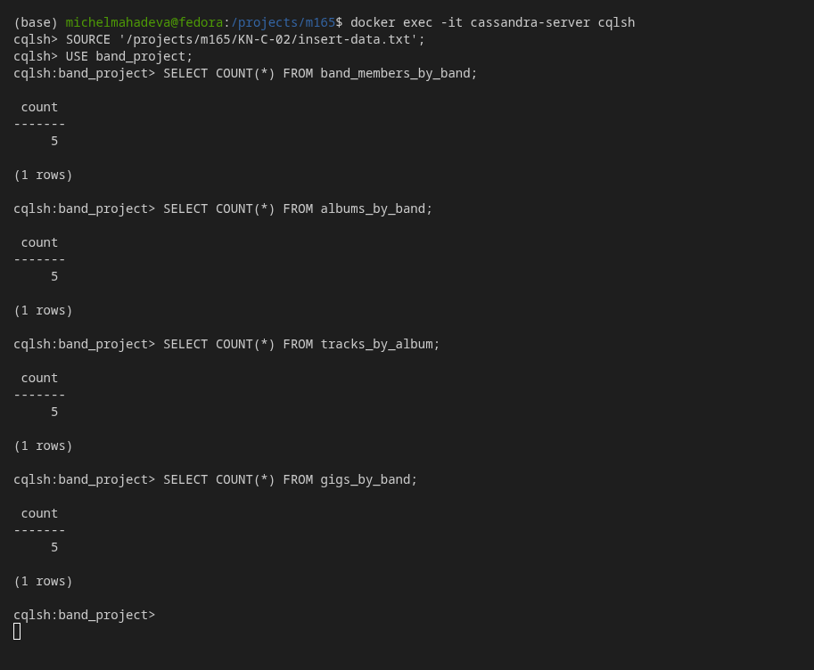
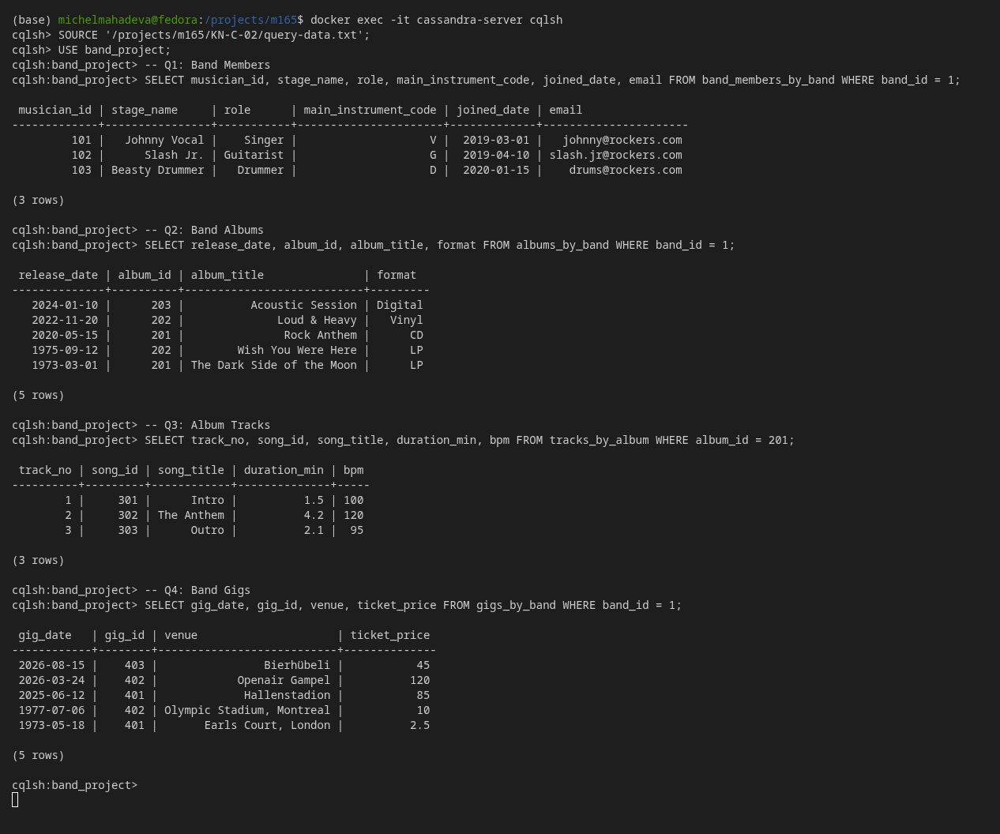
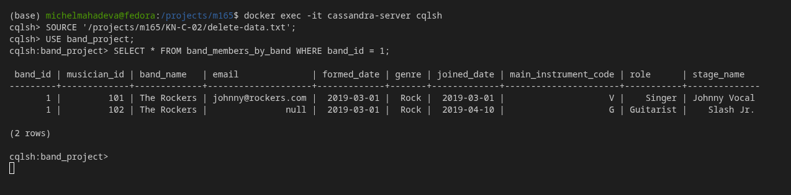
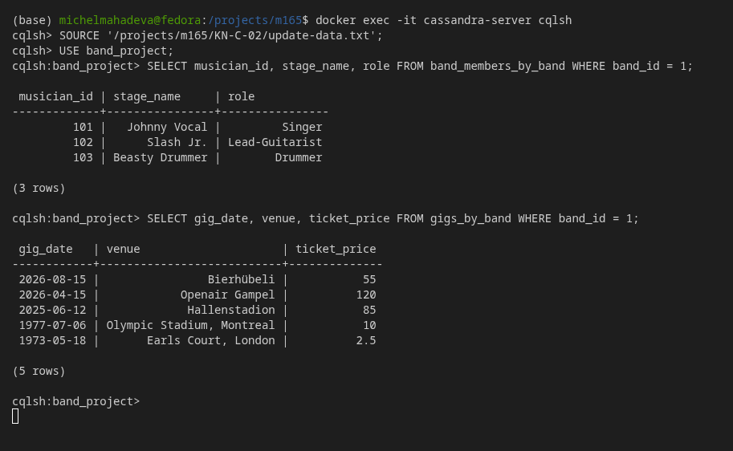

# KN-C-02: Datenabfrage und -Manipulation für Cassandra

**Thema:** Music band · **Keyspace:** `band_project`

---

## A) Daten hinzufügen (25%)

Um das Datenmodell zu testen, wurden den Tabellen Testdatensätze hinzugefügt. Dabei wurde darauf geachtet, pro Partitions-Key mehrere Einträge anzulegen, um die Funktionsweise der Clustering Keys (Sortierung auf Disk) zu validieren.

* Die SQL/CQL-Befehle befinden sich in der Datei [`insert-data.txt`](./insert-data.txt).



---

## B) Daten abfragen (25%)

Die in KN-C-01 definierten Query-Szenarien wurden in CQL umgesetzt und ausgeführt:

1. **Q1 (Mitglieder):** Abfrage aller Musiker der Band 1.
2. **Q2 (Diskographie):** Abfrage aller Alben der Band 1 (automatisch absteigend nach `release_date` sortiert).
3. **Q3 (Trackliste):** Abfrage aller Tracks von Album 201 (automatisch aufsteigend nach `track_no` sortiert).
4. **Q4 (Konzerte):** Abfrage aller Gigs von Band 1 (automatisch absteigend nach `gig_date` sortiert).

* Die Abfrage-Befehle befinden sich in der Datei [`query-data.txt`](./query-data.txt).



---

## C) Daten löschen (25%)

Es wurden gezielte Löschoperationen durchgeführt, um die Flexibilität von Cassandra bei Datenlöschungen zu testen.

1. **Löschen einer ganzen Zeile:** Der Schlagzeuger (`musician_id = 103`) der Band 1 wurde entfernt.
   `DELETE FROM band_members_by_band WHERE band_id = 1 AND musician_id = 103;`
2. **Löschen einer einzelnen Spalte:** Die E-Mail-Adresse von Musiker `102` (Slash Jr.) wurde gelöscht.
   `DELETE email FROM band_members_by_band WHERE band_id = 1 AND musician_id = 102;`

* Die Löschbefehle befinden sich in der Datei [`delete-data.txt`](./delete-data.txt).
* Zum vollständigen Leeren der Datenbank für Testwiederholungen wurde zudem das Skript [`cleanup-data.txt`](./cleanup-data.txt) mit `TRUNCATE`-Befehlen erstellt.

### Theorie-Frage: Spalten von einzelnen Zeilen löschen
**Können Sie Spalten von einzelnen Zeilen löschen?**
* **Ja, das ist möglich.** Mit der Syntax `DELETE spaltenname FROM tabelle WHERE ...` kann der Wert einer einzelnen Spalte in einer bestimmten Zeile entfernt werden.
* **Funktionsweise im Hintergrund:** Cassandra löscht Daten nicht sofort von der Festplatte, da dies bei einer verteilten Log-Structured Merge-tree (LSM) Speicherarchitektur sehr ineffizient wäre. Stattdessen wird ein sogenannter **Tombstone** (Grabstein) geschrieben. Dies ist ein spezieller Marker mit einem Zeitstempel, der besagt, dass diese Spalte gelöscht wurde. Bei Lesezugriffen überschreibt der neuere Tombstone-Wert den alten Wert und die Spalte wird dem Client als `null` zurückgegeben. Bei der nächsten Speicher-Kompression (Compaction) werden die alten Daten und der Tombstone endgültig physisch von der Festplatte gelöscht.
* **Einschränkung:** Spalten, die Teil des Primärschlüssels (Partition Key oder Clustering Keys) sind, können **nicht** einzeln gelöscht werden, da sie die Identität der Zeile bestimmen.



---

## D) Daten verändern (25%)

Updates in Cassandra verhalten sich aufgrund der Partitionierung anders als in relationalen Systemen. Im Folgenden werden drei praxisnahe Szenarien beschrieben.

* Die Update-Befehle befinden sich in der Datei [`update-data.txt`](./update-data.txt).

### 1. Szenario: Beförderung eines Bandmitglieds (Einfaches Update)
* **Anwendungsfall:** Der Gitarrist (`musician_id = 102`) der Band 1 hat sich bewiesen und wird zum "Lead-Guitarist" befördert.
* **CQL-Statement:**
  ```sql
  UPDATE band_members_by_band 
  SET role = 'Lead-Guitarist' 
  WHERE band_id = 1 AND musician_id = 102;
  ```
* **Erklärung:** Hierfür wird der komplette Primärschlüssel (`band_id` und `musician_id`) in der `WHERE`-Klausel benötigt. Da es sich um eine reguläre Spalte (`role`) handelt, kann sie direkt modifiziert werden.

### 2. Szenario: Verschiebung eines Konzerts (Herausforderung: Primärschlüssel-Änderung)
* **Anwendungsfall:** Das Konzert der Band 1 am `2026-03-24` muss aus organisatorischen Gründen auf den `2026-04-15` verschoben werden.
* **CQL-Statement:**
  ```sql
  -- Da gig_date ein Clustering Key (Teil des PK) ist, kann UPDATE nicht verwendet werden.
  -- Es muss ein DELETE gefolgt von einem INSERT durchgeführt werden.
  DELETE FROM gigs_by_band 
  WHERE band_id = 1 AND gig_date = '2026-03-24' AND gig_id = 402;

  INSERT INTO gigs_by_band (band_id, gig_date, gig_id, band_name, venue, ticket_price) 
  VALUES (1, '2026-04-15', 402, 'The Rockers', 'Openair Gampel', 120.0);
  ```
* **Erklärung (Die Herausforderung):** In Cassandra bestimmt der Primary Key (und damit auch der Clustering Key `gig_date`) den Speicherort und die Sortierung der Zeile auf der Festplatte. Daher erlaubt Cassandra **keine** direkte Aktualisierung von Primärschlüssel-Spalten. Eine Änderung erfordert zwingend das Löschen des alten Datensatzes und das Einfügen eines neuen Datensatzes.

### 3. Szenario: Ticketpreise anpassen (Update regulärer Spalten)
* **Anwendungsfall:** Aufgrund der hohen Nachfrage erhöht Band 1 den Ticketpreis für das Konzert im Bierhübeli am `2026-08-15` von 45 auf 55 CHF.
* **CQL-Statement:**
  ```sql
  UPDATE gigs_by_band 
  SET ticket_price = 55.0 
  WHERE band_id = 1 AND gig_date = '2026-08-15' AND gig_id = 403;
  ```
* **Erklärung:** Auch hier müssen alle Komponenten des Primärschlüssels (`band_id`, `gig_date`, `gig_id`) angegeben werden. Da `ticket_price` eine reguläre Spalte ist, erfolgt das Update problemlos.


