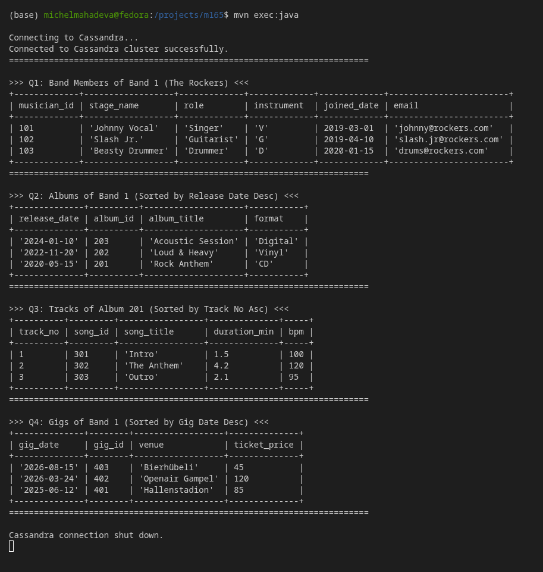

# KN-C-03: Programmierung mit Cassandra (Java Client)

**Thema:** Music band · **Keyspace:** `band_project` · **Sprache:** Java

---

## 1. Einleitung & Zielsetzung
In diesem Kompetenznachweis (KN-C-03) wird der programmatische Zugriff auf eine Apache Cassandra-Datenbank mithilfe eines selbst entwickelten Java-Clients realisiert. Als Grundlage dienen das Datenmodell und die Daten aus den vorherigen Kompetenznachweisen KN-C-01 und KN-C-02.

Der Fokus liegt darauf:
1. Eine Verbindung zu Cassandra aus einer Programmiersprache (Java) herzustellen.
2. Das offizielle Cassandra-Treiber-Paket kennenlernen und einsetzen.
3. Die vier definierten Abfragen (Q1 bis Q4) auszuführen und die Resultate übersichtlich auf der Konsole auszugeben.
4. Den theoretischen Hintergrund von Verbindungseinstellungen (Contact Points, Local Datacenter) und den Unterschied in der Authentifizierung im Vergleich zu MongoDB zu analysieren.

---

## 2. Projektstruktur & Konfiguration

Das Projekt wurde als Maven-Projekt aufgesetzt. Als Treiber wird der offizielle **DataStax Java Driver for Apache Cassandra (v4.17.0)** verwendet. Da im Treiber 4.x das Logging standardmässig über SLF4J läuft, wurde zudem `slf4j-simple` eingebunden.

### Maven-Konfiguration (`pom.xml`)
Die folgende `pom.xml` konfiguriert die Abhängigkeiten und setzt den Java-Compiler-Target auf Version 17:

```xml
<?xml version="1.0" encoding="UTF-8"?>
<project xmlns="http://maven.apache.org/POM/4.0.0"
         xmlns:xsi="http://www.w3.org/2001/XMLSchema-instance"
         xsi:schemaLocation="http://maven.apache.org/POM/4.0.0 http://maven.apache.org/xsd/maven-4.0.0.xsd">
    <modelVersion>4.0.0</modelVersion>

    <groupId>com.tbz.cassandra</groupId>
    <artifactId>kn-c-03</artifactId>
    <version>1.0.0</version>

    <properties>
        <maven.compiler.source>17</maven.compiler.source>
        <maven.compiler.target>17</maven.compiler.target>
        <project.build.sourceEncoding>UTF-8</project.build.sourceEncoding>
        <cassandra.driver.version>4.17.0</cassandra.driver.version>
    </properties>

    <dependencies>
        <!-- DataStax Java Driver for Apache Cassandra -->
        <dependency>
            <groupId>com.datastax.oss</groupId>
            <artifactId>java-driver-core</artifactId>
            <version>${cassandra.driver.version}</version>
        </dependency>

        <!-- SLF4J Simple binding for console logging -->
        <dependency>
            <groupId>org.slf4j</groupId>
            <artifactId>slf4j-simple</artifactId>
            <version>2.0.9</version>
        </dependency>
    </dependencies>

    <build>
        <plugins>
            <plugin>
                <groupId>org.codehaus.mojo</groupId>
                <artifactId>exec-maven-plugin</artifactId>
                <version>3.1.0</version>
                <configuration>
                    <mainClass>com.tbz.cassandra.App</mainClass>
                </configuration>
            </plugin>
        </plugins>
    </build>
</project>
```

---

## 3. Implementierung (Java Code)

Die Klasse `App.java` stellt die Verbindung zum lokalen Cassandra-Cluster her, nutzt den Keyspace `band_project` und führt die Abfragen Q1–Q4 aus. Sie formatiert die Ausgabe anschliessend in sauberen ASCII-Tabellen.

```java
package com.tbz.cassandra;

import com.datastax.oss.driver.api.core.CqlSession;
import com.datastax.oss.driver.api.core.cql.ResultSet;
import com.datastax.oss.driver.api.core.cql.Row;
import java.net.InetSocketAddress;
import java.time.LocalDate;

public class App {
    public static void main(String[] args) {
        // Setze Logger-Level hoch, um Warnungen/Infos des Treibers auszublenden
        System.setProperty("org.slf4j.simpleLogger.defaultLogLevel", "warn");
        
        System.out.println("Connecting to Cassandra...");
        
        try (CqlSession session = CqlSession.builder()
                .addContactPoint(new InetSocketAddress("127.0.0.1", 9042))
                .withLocalDatacenter("datacenter1")
                .withKeyspace("band_project")
                .build()) {
            
            System.out.println("Connected to Cassandra cluster successfully.");
            System.out.println("========================================================================");
            
            // Q1: Band Members
            System.out.println("\n>>> Q1: Band Members of Band 1 (The Rockers) <<<");
            ResultSet rs1 = session.execute(
                "SELECT musician_id, stage_name, role, main_instrument_code, joined_date, email " +
                "FROM band_members_by_band " +
                "WHERE band_id = 1;"
            );
            System.out.println("+-------------+------------------+-------------+-------------+-------------+------------------------+");
            System.out.printf("| %-11s | %-16s | %-11s | %-11s | %-11s | %-22s |\n", 
                "musician_id", "stage_name", "role", "instrument", "joined_date", "email");
            System.out.println("+-------------+------------------+-------------+-------------+-------------+------------------------+");
            for (Row row : rs1) {
                int musicianId = row.getInt("musician_id");
                String stageName = row.getString("stage_name");
                String role = row.getString("role");
                String instrument = row.getString("main_instrument_code");
                LocalDate joinedDate = row.getLocalDate("joined_date");
                String email = row.getString("email");
                System.out.printf("| %-11d | %-16s | %-11s | %-11s | %-11s | %-22s |\n", 
                    musicianId, 
                    stageName != null ? "'" + stageName + "'" : "null", 
                    role != null ? "'" + role + "'" : "null", 
                    instrument != null ? "'" + instrument + "'" : "null", 
                    joinedDate, 
                    email != null ? "'" + email + "'" : "null");
            }
            System.out.println("+-------------+------------------+-------------+-------------+-------------+------------------------+");
            System.out.println("========================================================================");
            
            // Q2: Albums
            System.out.println("\n>>> Q2: Albums of Band 1 (Sorted by Release Date Desc) <<<");
            ResultSet rs2 = session.execute(
                "SELECT release_date, album_id, album_title, format " +
                "FROM albums_by_band " +
                "WHERE band_id = 1;"
            );
            System.out.println("+--------------+----------+--------------------+-----------+");
            System.out.printf("| %-12s | %-8s | %-18s | %-9s |\n", 
                "release_date", "album_id", "album_title", "format");
            System.out.println("+--------------+----------+--------------------+-----------+");
            for (Row row : rs2) {
                LocalDate releaseDate = row.getLocalDate("release_date");
                int albumId = row.getInt("album_id");
                String albumTitle = row.getString("album_title");
                String format = row.getString("format");
                System.out.printf("| %-12s | %-8d | %-18s | %-9s |\n", 
                    releaseDate != null ? "'" + releaseDate + "'" : "null", 
                    albumId, 
                    albumTitle != null ? "'" + albumTitle + "'" : "null", 
                    format != null ? "'" + format + "'" : "null");
            }
            System.out.println("+--------------+----------+--------------------+-----------+");
            System.out.println("========================================================================");
            
            // Q3: Tracks
            System.out.println("\n>>> Q3: Tracks of Album 201 (Sorted by Track No Asc) <<<");
            ResultSet rs3 = session.execute(
                "SELECT track_no, song_id, song_title, duration_min, bpm " +
                "FROM tracks_by_album " +
                "WHERE album_id = 201;"
            );
            System.out.println("+----------+---------+-----------------+--------------+-----+");
            System.out.printf("| %-8s | %-7s | %-15s | %-12s | %-3s |\n", 
                "track_no", "song_id", "song_title", "duration_min", "bpm");
            System.out.println("+----------+---------+-----------------+--------------+-----+");
            for (Row row : rs3) {
                int trackNo = row.getInt("track_no");
                int songId = row.getInt("song_id");
                String songTitle = row.getString("song_title");
                double durationMin = row.getDouble("duration_min");
                int bpm = row.getInt("bpm");
                System.out.printf("| %-8d | %-7d | %-15s | %-12.1f | %-3d |\n", 
                    trackNo, 
                    songId, 
                    songTitle != null ? "'" + songTitle + "'" : "null", 
                    durationMin, 
                    bpm);
            }
            System.out.println("+----------+---------+-----------------+--------------+-----+");
            System.out.println("========================================================================");
            
            // Q4: Gigs
            System.out.println("\n>>> Q4: Gigs of Band 1 (Sorted by Gig Date Desc) <<<");
            ResultSet rs4 = session.execute(
                "SELECT gig_date, gig_id, venue, ticket_price " +
                "FROM gigs_by_band " +
                "WHERE band_id = 1;"
            );
            System.out.println("+--------------+--------+------------------+--------------+");
            System.out.printf("| %-12s | %-6s | %-16s | %-12s |\n", 
                "gig_date", "gig_id", "venue", "ticket_price");
            System.out.println("+--------------+--------+------------------+--------------+");
            for (Row row : rs4) {
                LocalDate gigDate = row.getLocalDate("gig_date");
                int gigId = row.getInt("gig_id");
                String venue = row.getString("venue");
                double ticketPrice = row.getDouble("ticket_price");
                System.out.printf("| %-12s | %-6d | %-16s | %-12.0f |\n", 
                    gigDate != null ? "'" + gigDate + "'" : "null", 
                    gigId, 
                    venue != null ? "'" + venue + "'" : "null", 
                    ticketPrice);
            }
            System.out.println("+--------------+--------+------------------+--------------+");
            System.out.println("========================================================================");
            
            System.out.println("\nCassandra connection shut down.");
        } catch (Exception e) {
            System.err.println("Error connecting to Cassandra or running queries:");
            e.printStackTrace();
        }
    }
}
```

---

## 4. Ausführung & Screenshots

### Projekt ausführen (Anleitung)
Um das Java-Projekt auszuführen, führen Sie folgende Befehle im Terminal aus:

1. **In das Projektverzeichnis wechseln:**
   ```bash
   cd KN-C-03
   ```
2. **Kompilieren und Ausführen mithilfe der mitgelieferten lokalen Maven-Installation:**
   ```bash
   # Projekt bereinigen und kompilieren
   ./maven/bin/mvn clean compile
   
   # Java-Applikation ausführen und Abfragen starten
   ./maven/bin/mvn exec:java
   ```
   *Hinweis:* Falls Sie eine globale Maven-Installation besitzen, können Sie auch direkt `mvn clean compile` und `mvn exec:java` ausführen.



---

## 5. Theoriefragen & Analyse

### 5.1 Parameter zur Verbindungssteuerung in Cassandra-Treibern
Beim Verbindungsaufbau in Cassandra (hier via Java `CqlSession.builder()`) spielen folgende Konzepte eine zentrale Rolle:

1. **Contact Points (`addContactPoint`)**:
   * **Bedeutung:** Ein Contact Point ist eine IP-Adresse und ein Port (standardmässig `9042`) eines beliebigen, bereits aktiven Knotens (Nodes) im Cassandra-Cluster.
   * **Funktionsweise:** Der Treiber benötigt beim Start mindestens einen funktionierenden Contact Point, um sich zu authentifizieren und das erste Mal mit dem Cluster zu sprechen. Sobald die Verbindung steht, ruft der Treiber automatisch die **Cluster-Metadaten** (eine Liste aller Nodes, deren Token-Ranges und Status) ab. Er baut daraufhin Verbindungen zu allen anderen Nodes im Cluster auf. Man muss somit nicht alle Server-IPs des Clusters im Code eintragen, da der Treiber sich die Topologie selbstständig erfragt.
2. **Local Datacenter (`withLocalDatacenter`)**:
   * **Bedeutung:** Legt den Namen des logischen Rechenzentrums fest (z.B. `datacenter1`), in dem sich die primären Kontakte für den Treiber befinden.
   * **Wichtigkeit:** In Cassandra 4.x ist dieser Parameter für Treiber **zwingend erforderlich**. Cassandra-Cluster können sich über mehrere geografische Rechenzentren erstrecken. Der Treiber verwendet diese Angabe, um Load-Balancing-Entscheidungen zu treffen. Er sendet Anfragen bevorzugt an Nodes im *lokalen* Rechenzentrum, um Latenzzeiten und WAN-Kosten zu minimieren. Würde der Parameter fehlen, wüsste der Treiber nicht, welche Nodes er bevorzugen soll, was zu unvorhersehbarem Routing führen kann.
3. **Keyspace (`withKeyspace`)**:
   * **Bedeutung:** Bindet die Session direkt an einen Standard-Keyspace (hier `band_project`). 
   * **Vorteil:** Dadurch entfällt die Notwendigkeit, in CQL-Anfragen den Keyspace-Namen voranzustellen (z.B. `band_project.gigs_by_band`), oder ein explizites `USE band_project;` vor jeder Abfrage auszuführen.

---

### 5.2 Vergleich der Authentifizierung: MongoDB vs. Cassandra

Im Folgenden wird die Funktionsweise von Verbindungs- und Authentifizierungs-Szenarien beider Systeme detailliert analysiert und gegenübergestellt.

#### A) MongoDB und der Parameter `authSource=admin`
In MongoDB sind Benutzerkonten und Berechtigungen logisch an **eine bestimmte Datenbank** gebunden.

* **Funktionsweise:** Wenn ein Administrator-Benutzer (z.B. `root` oder `adminUser`) angelegt wird, werden seine Credentials und Berechtigungen standardmässig in der Datenbank `admin` gespeichert. Möchte eine Applikation nun auf eine Anwendungsdatenbank (z.B. `band_project`) zugreifen, muss sie sich dennoch mit dem Benutzer anmelden, der in der `admin`-Datenbank definiert ist.
* **Was bewirkt `authSource`?** Der Parameter `authSource=admin` in der Connection-URI teilt dem MongoDB-Treiber mit, dass er die Authentifizierungsprüfung in der Datenbank `admin` (wo die Credentials liegen) durchführen soll, obwohl die nachfolgenden Lese- und Schreibzugriffe auf der Zieldatenbank `band_project` stattfinden. 
* **Auswirkung bei Fehlen:** Wird `authSource` weggelassen, sucht MongoDB die Benutzerdaten standardmässig in der Zieldatenbank (`band_project`). Da der administrative Benutzer dort nicht existiert, schlägt der Verbindungsaufbau mit einem Authentifizierungsfehler fehl.
* **Zitat aus der offiziellen Dokumentation:**
  > *"Specify the database name associated with the user's credentials. If `authSource` is not specified, it defaults to the database name specified in the connection string."*  
  > — [MongoDB Connection String URI Specifications](https://www.mongodb.com/docs/manual/reference/connection-string/)

#### B) Cassandra und das Fehlen von `authSource`
Apache Cassandra verfolgt ein grundlegend anderes, globalisiertes Sicherheitskonzept.

* **Funktionsweise:** In Cassandra erfolgt die Authentifizierung auf **Protokoll- bzw. Clusterebene**. Die Benutzerkonten, Rollen und Berechtigungen werden global im systemeigenen, zentralen Keyspace `system_auth` (in Tabellen wie `system_auth.roles`) verwaltet und repliziert.
* **Warum gibt es kein `authSource` in Cassandra?** Da alle Anmeldedaten im gesamten Cluster global in `system_auth` liegen, muss der Treiber beim Verbindungsaufbau keine spezifische Datenbank (Keyspace) angeben, in der nach dem Benutzer gesucht wird. Die Authentifizierungs-Engine prüft das Passwort immer gegen `system_auth`.
* **Prozessablauf:** 
  1. Der Client baut eine TCP-Verbindung zu einem Contact Point auf Port `9042` auf.
  2. Der Client sendet die Anmeldedaten im Cassandra-Binary-Protocol-Header.
  3. Der Cassandra-Knoten prüft die Credentials über den konfigurierten Authenticator (z.B. `PasswordAuthenticator`) global in `system_auth`.
  4. Nach erfolgreichem Login steht die Session. Der Benutzer kann nun beliebige Keyspaces abfragen (z.B. über `session.execute("USE band_project")` oder per `withKeyspace()`), sofern seine Rolle die entsprechenden Berechtigungen besitzt.
* **Zitat aus der offiziellen Dokumentation:**
  > *"Role-based access control (RBAC) in Cassandra is database-wide. All roles are defined globally in the system_auth keyspace and are valid across all keyspaces in the cluster."*  
  > — [Apache Cassandra Security Documentation](https://cassandra.apache.org/doc/latest/cassandra/operating/security.html#authentication)

---

## 6. Fazit
Durch den Einsatz des offiziellen Java-Treibers konnte eine performante Verbindung zu Cassandra realisiert werden. Dank des Query-Driven-Designs von Cassandra und der exakten Definition der Partition- und Clustering-Keys in den Tabellen liefert der Java-Client die Abfrageresultate äusserst effizient und in der gewünschten Sortierung zurück. Die im Code integrierten Tabellen-Formatierer stellen sicher, dass die Daten übersichtlich präsentiert werden. Die Unterschiede zu dokumentenorientierten Datenbanken wie MongoDB bei der Verbindungssteuerung und Benutzerauthentifizierung verdeutlichen die dezentrale, globale Architektur von Apache Cassandra.
