# KN-M-01: Installation und Verwaltung von MongoDB

**Instanz:** `3.212.243.189` · **Datenbank:** `Mahadeva` · **Collection:** `Michel`

**Abgabedateien:** `cloudinit-mongodb.yaml`, `create-users.js`, `Mahadeva.Michel.json`

---

## A) Installation

### Abgabe: Cloud-Init

Angepasste Datei: [`cloudinit-mongodb.yaml`](./cloudinit-mongodb.yaml) (eigenes Admin-Passwort, eigener SSH-Key, Lehrer-Keys beibehalten).

### Screenshots

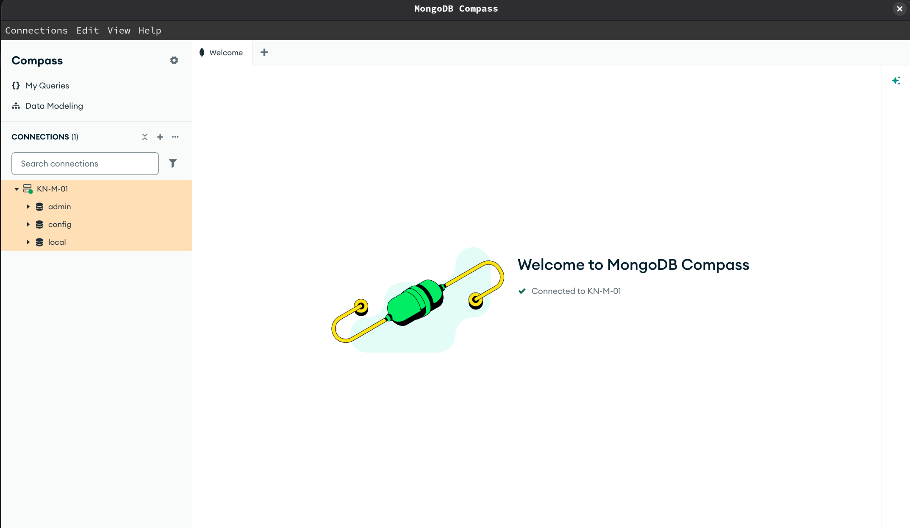

*Compass verbunden — bestehende Datenbanken sichtbar.*

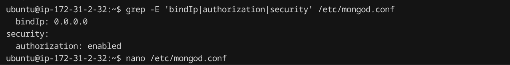

*`/etc/mongod.conf` — geänderte Werte nach den beiden `sed`-Befehlen im Cloud-Init.*

### Erklärung: `authSource=admin`

`authSource` legt fest, **in welcher Datenbank** MongoDB Benutzername und Passwort prüft. Der Admin-User wird im Cloud-Init mit `use admin; db.createUser(...)` angelegt — die Credentials liegen in **`admin`**. Daher muss der Connection String `authSource=admin` enthalten; sonst sucht MongoDB die Anmeldedaten in der falschen DB und die Authentifizierung schlägt fehl.

### Erklärung: Die zwei `sed`-Befehle

**1.** `sed -i 's/127.0.0.1/0.0.0.0/g' /etc/mongod.conf`  
Setzt `bindIp` von localhost auf alle Interfaces, damit Compass von aussen verbinden kann. Ohne diesen Schritt lauscht MongoDB nur auf `127.0.0.1`.

**2.** `sed` in `mongodconfupdate.sh` aktiviert `security: authorization: enabled`.  
Erzwingt Login für alle Zugriffe. Notwendig, nachdem der Admin-User erstellt wurde — sonst wäre die DB weiterhin ohne Authentifizierung erreichbar.

---

## B) Erste Schritte GUI

### Screenshots

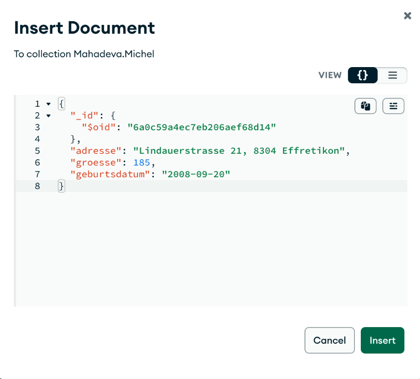

*Insert-Dialog mit JSON (string, int, Datum als Text) **bevor** Insert.*

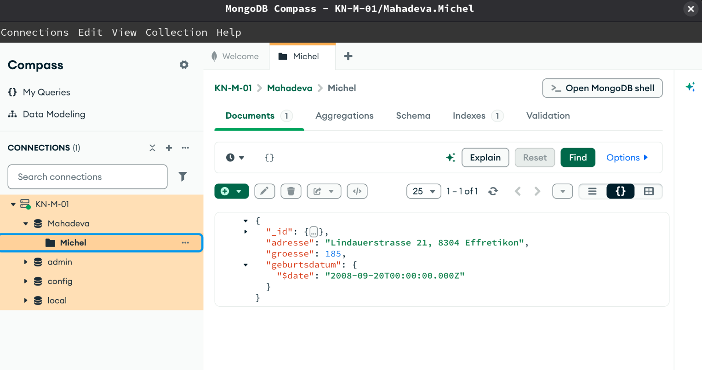

*Datenbank `Mahadeva`, Collection `Michel`, Dokument mit `geburtsdatum` als BSON-Date.*

### Abgabe: Export

[`Mahadeva.Michel.json`](./Mahadeva.Michel.json)

### Erklärung: Datum und Extended JSON

JSON hat keinen eigenen Datumstyp — `"2008-09-20"` wird als **String** gespeichert. Im Export erscheint ein echtes Datum als Extended JSON: `"geburtsdatum": { "$date": "2008-09-20T00:00:00.000Z" }`.

**Direkt beim Insert** hätte man Extended JSON verwenden müssen, z. B. `"geburtsdatum": { "$date": "2008-09-20T00:00:00.000Z" }` oder in mongosh `ISODate("2008-09-20")`.

**Warum nötig:** Für Abfragen, Sortierung und Indizes auf Zeitfelder braucht MongoDB den BSON-Typ `Date`, nicht `string`. Gleiches Prinzip gilt für andere BSON-Typen (`$oid`, `$numberDecimal`, …).

---

## C) Erste Schritte Shell

### Screenshots

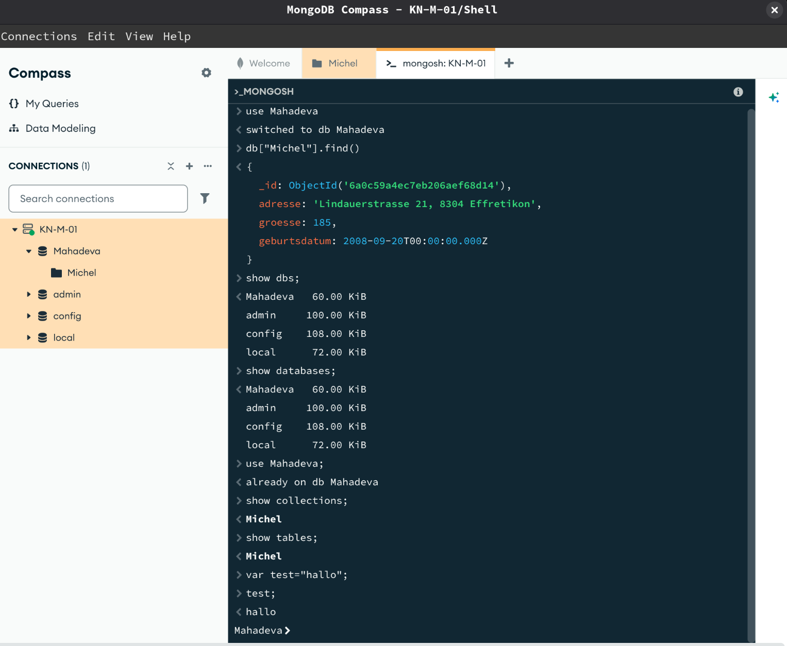

*Befehle 1–7 in der integrierten MONGOSH-Shell.*

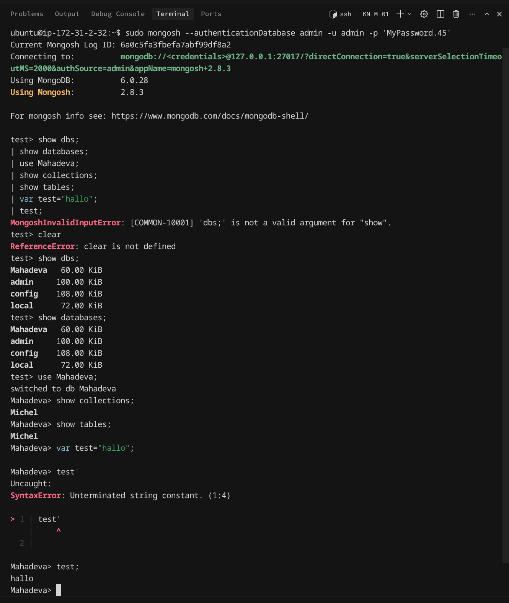

*Dieselben Befehle auf dem AWS-Server via `sudo mongosh`.*

### Erklärung: Befehle 1–5

| Befehl | Wirkung |
|--------|---------|
| `show dbs;` / `show databases;` | Listet Datenbanken (Aliase, gleiche Ausgabe). |
| `use Mahadeva;` | Wechselt in die Datenbank `Mahadeva`. |
| `show collections;` / `show tables;` | Listet Collections (Aliase, gleiche Ausgabe). |

**Collections vs. Tables:** In MongoDB heissen die Container **Collections**. `show tables` ist nur ein SQL-kompatibler Alias in mongosh — kein separates Konzept.

**Befehle 6–7:** `mongosh` ist eine JavaScript-REPL; `var test="hallo";` und `test;` zeigen, dass JS-Ausdrücke in der Shell möglich sind (Bezug zu JSON).

---

## D) Rechte und Rollen

### Abgabe: Benutzer-Skript

[`create-users.js`](./create-users.js) — `reader1` (`read` auf `Mahadeva`, Auth-DB `Mahadeva`), `writer1` (`readWrite` auf `Mahadeva`, Auth-DB `admin`).

### Screenshots

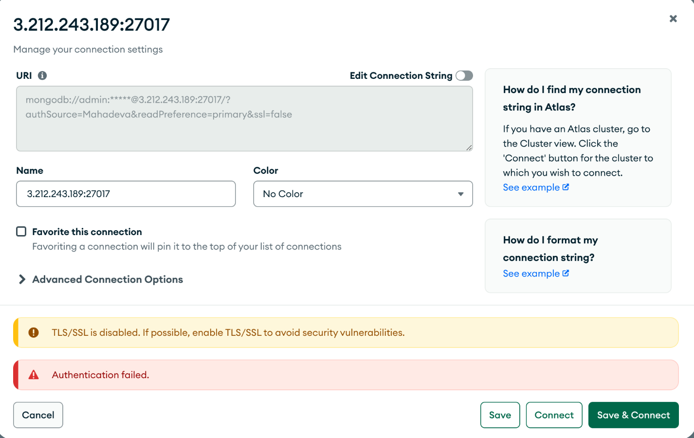

*Admin-User mit `authSource=Mahadeva` statt `admin` — Authentifizierung schlägt fehl.*

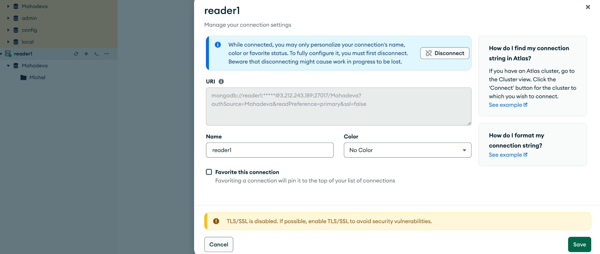

*`reader1` verbunden, `authSource=Mahadeva`.*

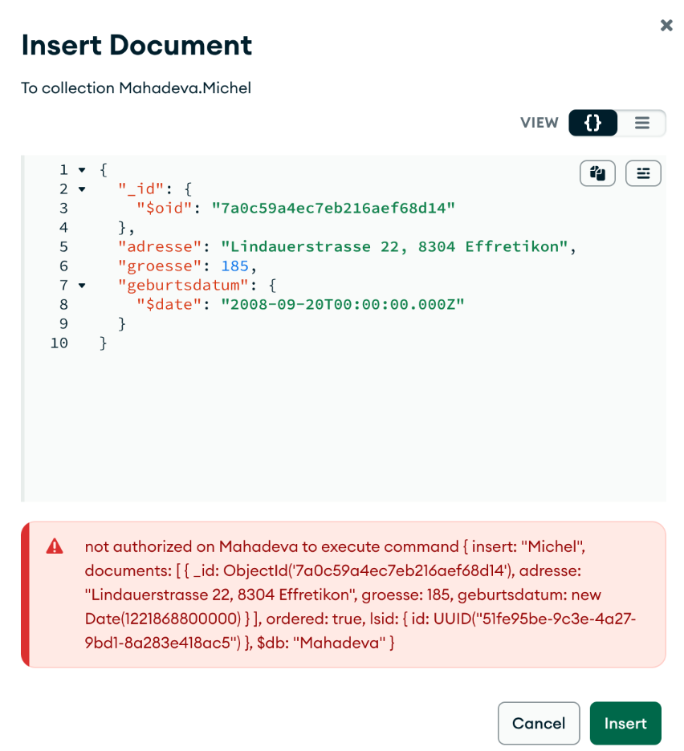

*`reader1` — Lesen möglich, Schreiben mit Fehler (keine `readWrite`-Rolle).*

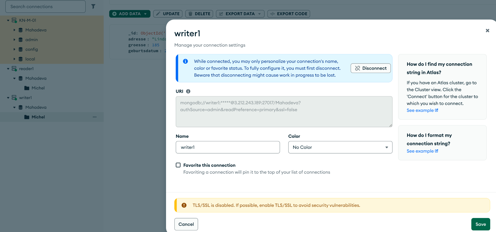

*`writer1` verbunden, `authSource=admin`.*

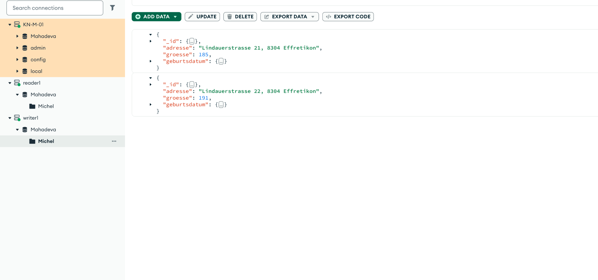

*`writer1` — Lesen und Schreiben erfolgreich.*

### Erklärung: `authSource` bei den Benutzern

Der Admin-User liegt in **`admin`** — falscher `authSource` (Teil D.1) führt deshalb zu einem Auth-Fehler.

- **reader1:** Credentials in **`Mahadeva`** → `authSource=Mahadeva`, Rolle `read` nur auf `Mahadeva`.
- **writer1:** Credentials in **`admin`**, Rolle `readWrite` auf **`Mahadeva`** → `authSource=admin`, Arbeit in DB `Mahadeva`.

`authSource` muss immer die Datenbank sein, **in der der Benutzer definiert wurde** — nicht beliebig wählbar.
