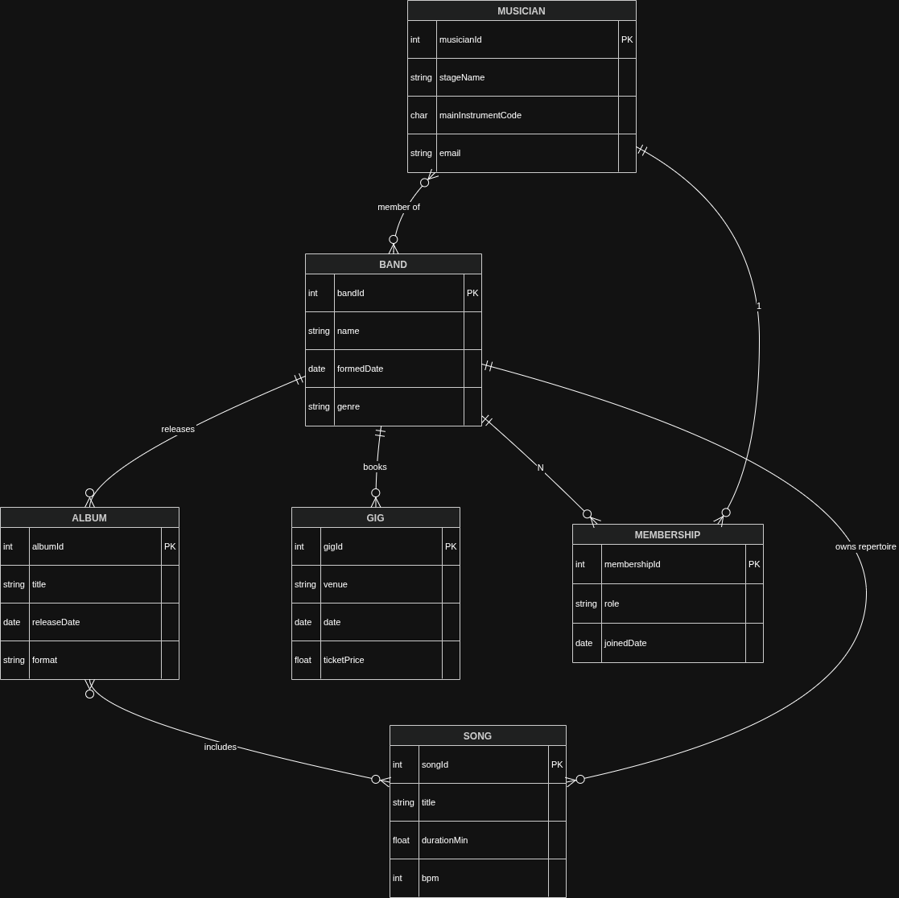
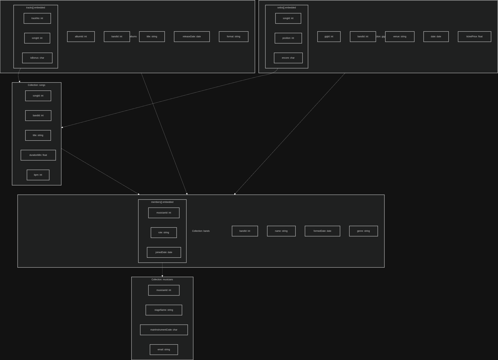
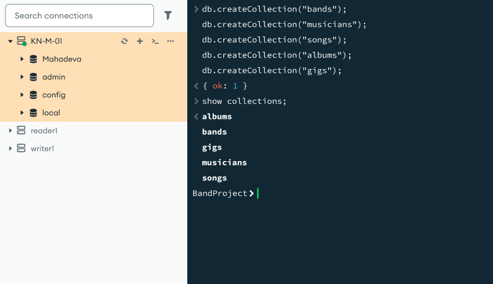

# KN-M-02: Datenmodellierung für MongoDB

**Thema:** Music band · **Instanz:** `3.212.243.189` · **Datenbank:** `BandProject`

**Abgabedateien:** [`conceptual-model.drawio`](./conceptual-model.drawio), [`logical-model.drawio`](./logical-model.drawio), [`create-collections.js`](./create-collections.js)

---

## A) Konzeptionelles Datenmodell (30 %)

### Diagramm

Quelldatei: [`conceptual-model.drawio`](./conceptual-model.drawio)

*ERM mit 6 Entitäten; N:N Musician ↔ Band (über Membership) und Album ↔ Song.*

### Erklärung: Entitäten

| Entität | Bedeutung | Attribute |
|---------|-----------|-----------|
| **BAND** | Die Musikgruppe | `bandId` (int, PK), `name` (string), `formedDate` (date), `genre` (string) |
| **MUSICIAN** | Künstler:in | `musicianId` (int, PK), `stageName` (string), `mainInstrumentCode` (char), `email` (string) |
| **SONG** | Stück im Repertoire | `songId` (int, PK), `title` (string), `durationMin` (float), `bpm` (int) |
| **ALBUM** | Veröffentlichung | `albumId` (int, PK), `title` (string), `releaseDate` (date), `format` (string) |
| **GIG** | Live-Auftritt | `gigId` (int, PK), `venue` (string), `date` (date), `ticketPrice` (float) |
| **MEMBERSHIP** | Zugehörigkeit Musiker:in ↔ Band | `membershipId` (int, PK), `role` (string), `joinedDate` (date) |

### Erklärung: Beziehungen

| Von | Nach | Typ | Beschriftung |
|-----|------|-----|--------------|
| MUSICIAN | BAND | **N:N** | *member of* |
| MUSICIAN | MEMBERSHIP | 1:N | — |
| BAND | MEMBERSHIP | 1:N | — |
| BAND | SONG | 1:N | *owns repertoire* |
| BAND | ALBUM | 1:N | *releases* |
| BAND | GIG | 1:N | *books* |
| ALBUM | SONG | **N:N** | *includes* |

Die **N:N-Beziehung** Musician ↔ Band wird über **Membership** aufgelöst. Ein:e Musiker:in kann in mehreren Bands sein; eine Band hat viele Mitglieder. Album ↔ Song ist die zweite N:N (z. B. Compilation, Song auf mehreren Alben).

---

## B) Logisches Modell für MongoDB (60 %)

### Diagramm

Quelldatei: [`logical-model.drawio`](./logical-model.drawio)

*5 Collections mit eingebetteten Arrays `members[]`, `tracks[]`, `setlist[]`.*

### Erklärung: Abbildung konzeptionell → logisch

| Konzeptionell | MongoDB |
|---------------|---------|
| BAND | Collection `bands` |
| MUSICIAN | Collection `musicians` |
| SONG | Collection `songs` (+ `bandId`) |
| ALBUM | Collection `albums` (+ `bandId`) |
| GIG | Collection `gigs` (+ `bandId`) |
| MEMBERSHIP | Eingebettet: `members[]` in `bands` |
| ALBUM ↔ SONG | Eingebettet: `tracks[]` in `albums` (`songId` als Referenz) |
| Setlist (Gig ↔ Song) | Eingebettet: `setlist[]` in `gigs` |

### Erklärung: Verschachtelungen

| Verschachtelung | Begründung |
|-----------------|------------|
| **`members[]` in `bands`** | Abfrage „alle Mitglieder einer Band“ mit einem `findOne`/`find` — ohne `$lookup`. Membership-Daten werden praktisch immer im Band-Kontext gebraucht. |
| **`tracks[]` in `albums`** | Album inkl. Trackliste in einer Abfrage; Song-Stammdaten bleiben in `songs` (keine volle Song-Redundanz). Entspricht N:N Album–Song im Document-Store-Stil. |
| **`setlist[]` in `gigs`** | Reihenfolge (`position`) und Encore (`encore` als char) gehören zum Auftritt, nicht zum Song-Dokument. |

**Nicht gewählt:** separate Collection `memberships` (mehr Joins) bzw. ein Mega-Dokument mit allen Daten (zu viele Redundanzen, vgl. Theorie DocumentStore-Model2).

### Datentypen im logischen Modell

| Typ | Beispiele |
|-----|-----------|
| int | `bandId`, `songId`, `bpm`, `trackNo` |
| float | `durationMin`, `ticketPrice` |
| string | `name`, `title`, `role`, `venue` |
| char | `mainInstrumentCode`, `isBonus`, `encore` |
| date | `formedDate`, `joinedDate`, `releaseDate`, Gig-`date` |

---

## C) Anwendung in MongoDB (10 %)

**Datenbank:** `BandProject` — zuerst `use BandProject;` (einzeln), danach Script.

### Script

[`create-collections.js`](./create-collections.js)

### Screenshot

*`BandProject>` — `createCollection` für alle 5 Collections, `show collections` mit `albums`, `bands`, `gigs`, `musicians`, `songs`.*
