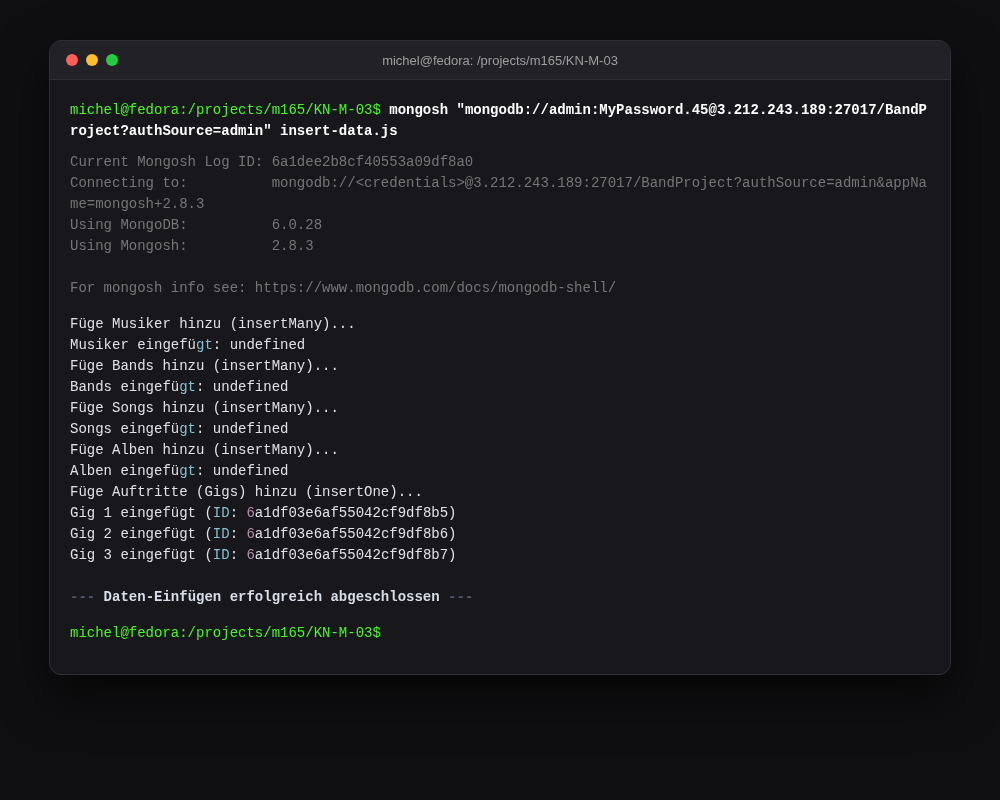
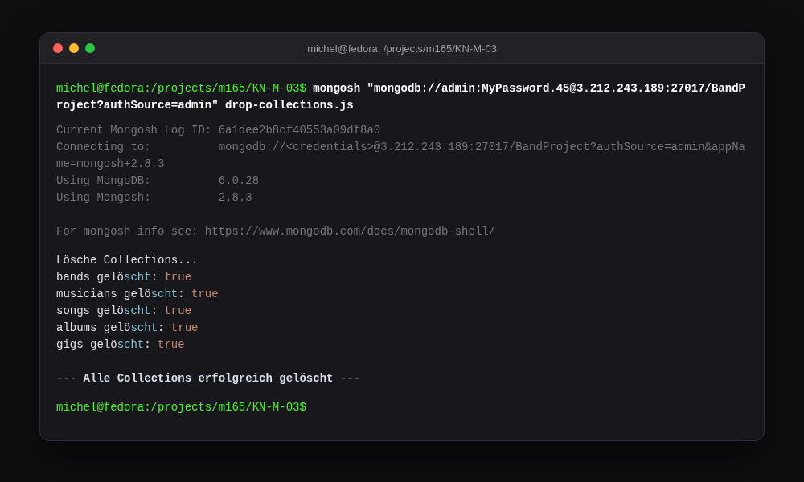
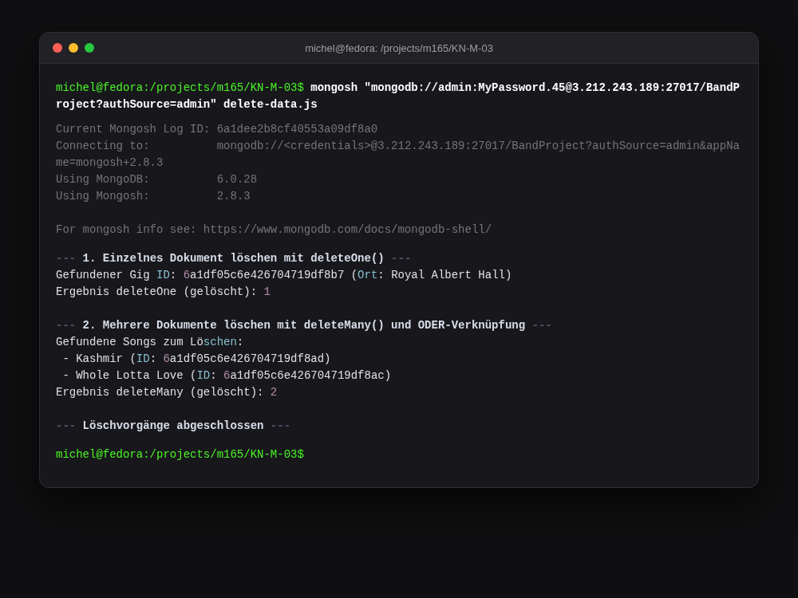
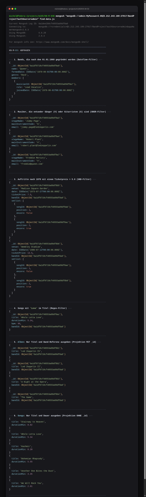
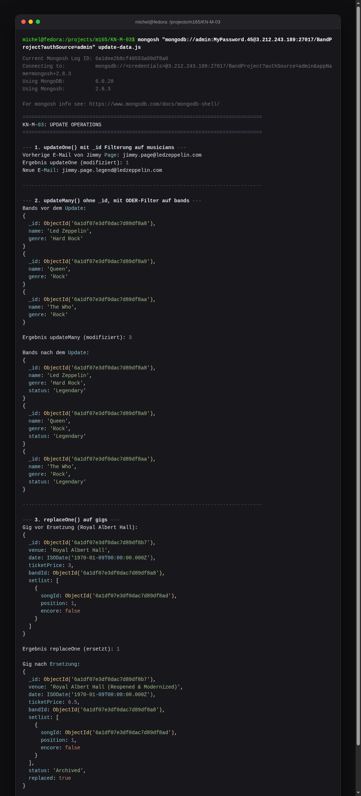

# KN-M-03: Datenmanipulation und Abfragen I

**Thema:** Music band · **Instanz:** `3.212.243.189` · **Datenbank:** `BandProject`

**Abgabedateien:** [`insert-data.js`](./insert-data.js), [`drop-collections.js`](./drop-collections.js), [`delete-data.js`](./delete-data.js), [`find-data.js`](./find-data.js), [`update-data.js`](./update-data.js)

---

## A) Daten hinzufügen (25 %)

### Abzugebender Screenshot:

*Terminal-Ausgabe, die das erfolgreiche Einfügen aller Datensätze via `insertOne()` und `insertMany()` zeigt.*

---

## B) Daten löschen (25 %)

### Abzugebende Screenshots:

*Ausgabe des Befehls `drop-collections.js` – zeigt, dass alle 5 Collections erfolgreich gedroppt wurden (Rückgabewert `true`).*

*Ausgabe des Befehls `delete-data.js` – zeigt die Löschung eines einzelnen Gigs via `deleteOne()` und zweier Songs via `deleteMany()` unter Verwendung einer `$or`-Verknüpfung auf `_id`.*

---

## C) Daten abfragen (25 %)

### Abzugebender Screenshot:

*Die Ausgabe aller 6 Suchabfragen aus `find-data.js` in der Shell.*

---

## D) Daten verändern (25 %)

### Abzugebender Screenshot:

*Ausgabe des Skripts `update-data.js`, welches die Modifikationen via `updateOne()`, `updateMany()` und `replaceOne()` dokumentiert.*
