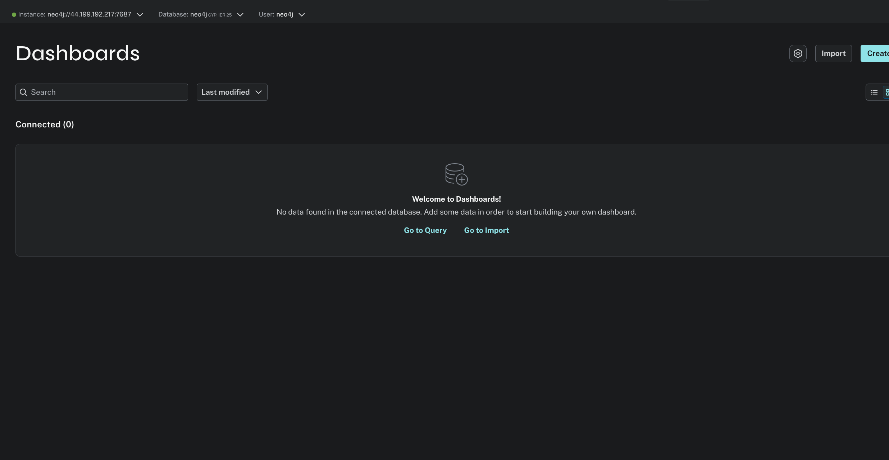
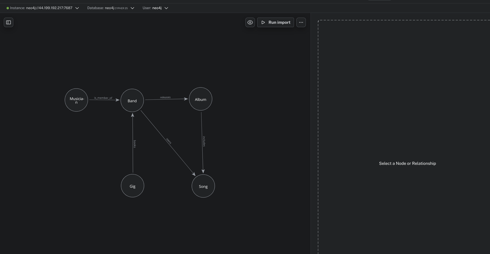

# KN-N-01: Installation und Datenmodellierung für Neo4j

## A) Installation / Account erstellen

Die Neo4j-Datenbank wurde erfolgreich konfiguriert und gestartet (bereitgestellt als Docker-Container auf der lokalen Instanz).

### Screenshot: Erfolgreicher Verbindungstest

*Der Screenshot zeigt den erfolgreichen Verbindungsaufbau zur Neo4j-Datenbank über die `cypher-shell`.*

### Theorie: Connection Strings und Authentifizierung
In Neo4j wird typischerweise das `neo4j://` oder `bolt://` Protokoll für Verbindungen genutzt. 
* **Protokolle**: `neo4j://` unterstützt intelligentes Routing für Cluster-Setups (wie Neo4j Aura), während `bolt://` eine direkte Verbindung zu einer spezifischen Server-Instanz aufbaut.
* **Authentifizierung**: Im Gegensatz zu MongoDB – wo oft der Connection-String-Parameter `authSource=admin` benötigt wird, um den Authentifizierungskontext explizit auf die `admin`-Datenbank zu lenken – erfolgt die Authentifizierung bei Neo4j zentral über das integrierte Identity Management (gespeichert in der `system` Datenbank). Die Credentials (Benutzername und Passwort) werden direkt an den Neo4j-Driver oder die Shell (z.B. via `-u` und `-p` Parameter) übergeben, ohne dass eine spezifische "Authentication Source" Datenbank im URI deklariert werden muss.

---

## B) Logisches Modell für Neo4j

Basierend auf dem konzeptionellen Modell des Band-Projekts aus den vorherigen Modulen wurde das folgende logische Datenmodell für Neo4j entworfen.

### Screenshot: Logisches Datenmodell

### Erklärung zu den Attributen und ihrer Verteilung

Im Property-Graph-Modell von Neo4j können im Gegensatz zu klassischen relationalen Datenbanken sowohl Knoten (Nodes) als auch Kanten (Relationships) Attribute (Properties) speichern. Dies ermöglicht eine sehr natürliche Modellierung der Realität.

#### Verteilung auf Knoten (Nodes)
Knoten repräsentieren die Kern-Entitäten. Sie enthalten die intrinsischen Eigenschaften, die unabhängig von anderen Entitäten existieren.
* **`Musician`**: `{musicianId, stageName, mainInstrumentCode, email}` – Diese Attribute beschreiben die Person des Musikers.
* **`Band`**: `{bandId, name, formedDate, genre}` – Die Stammdaten der Musikgruppe.
* **`Song`**: `{songId, title, durationMin, bpm}` – Die Eigenschaften eines einzelnen Musikstücks.
* **`Album`**: `{albumId, title, releaseDate, format}` – Metadaten einer bestimmten Veröffentlichung.
* **`Gig`**: `{gigId, venue, date, ticketPrice}` – Details zu einem spezifischen Live-Auftritt.

#### Verteilung auf Kanten (Relationships)
Kanten beschreiben nicht nur die Art der Beziehung, sondern tragen in diesem Modell auch Attribute, die **ausschließlich im Kontext dieser spezifischen Verbindung** Sinn ergeben (Beziehungs-Attribute). Dadurch wird die Bedingung erfüllt, dass mindestens eine Kante Attribute besitzen muss.

* **`IS_MEMBER_OF` (Musician → Band)**
  * **Attribute:** `{role, joinedDate}`
  * **Erklärung:** Die Rolle (z.B. "Lead Guitar") und das Eintrittsdatum gehören weder alleinig zum Musiker (da er in verschiedenen Bands unterschiedliche Rollen haben kann) noch alleinig zur Band. Sie beschreiben den Zustand der Mitgliedschaft. Durch das Speichern auf der Kante wird eine künstliche Zwischen-Entität (wie z.B. eine Mapping-Tabelle in SQL) überflüssig und die N:N-Beziehung elegant aufgelöst.
  
* **`INCLUDES` (Album → Song)**
  * **Attribute:** `{trackNo, isBonus}`
  * **Erklärung:** Da ein Song auf mehreren Alben (Original, Best-Of, Live) erscheinen kann, ist die Tracknummer spezifisch für die Verknüpfung zwischen genau einem Album und einem Song.

Durch diese Modellierungsstrategie wird Datenredundanz minimiert und die Traversierung des Graphen bei komplexen Abfragen (z.B. "Welche Rolle spielte Musiker X in Band Y im Jahr 2018?") stark vereinfacht und beschleunigt.
