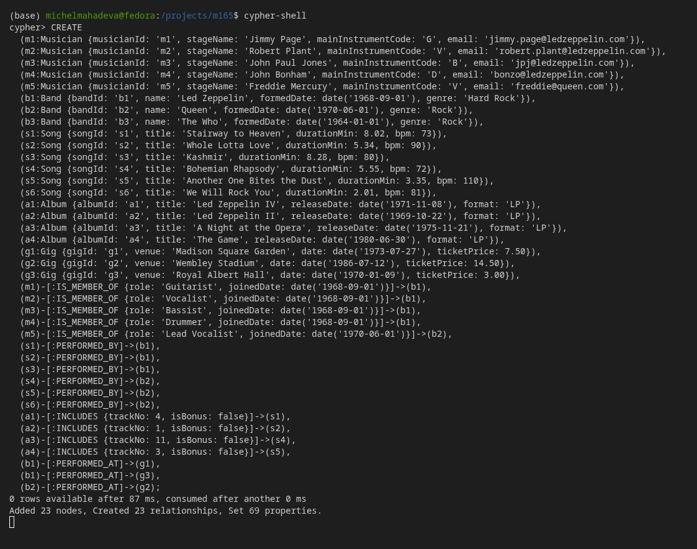
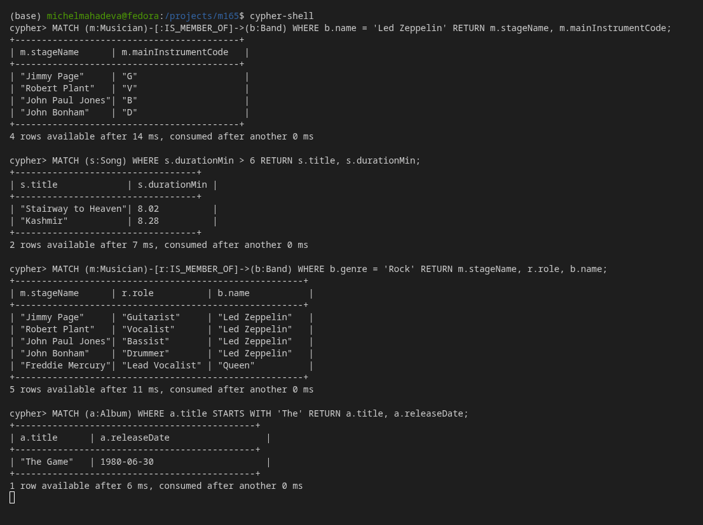
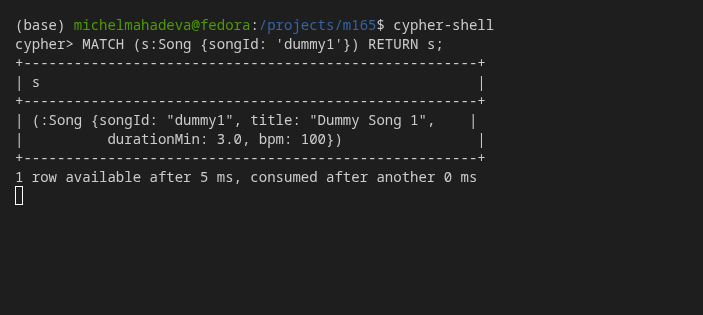
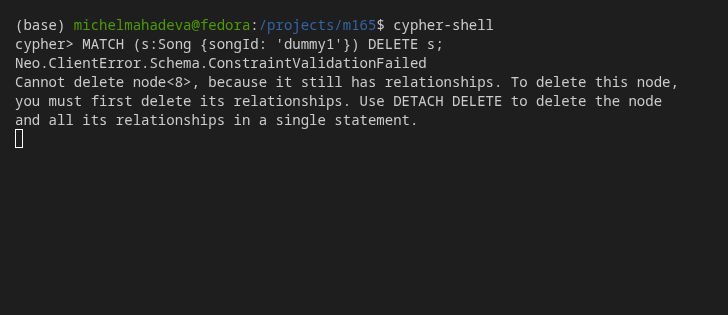
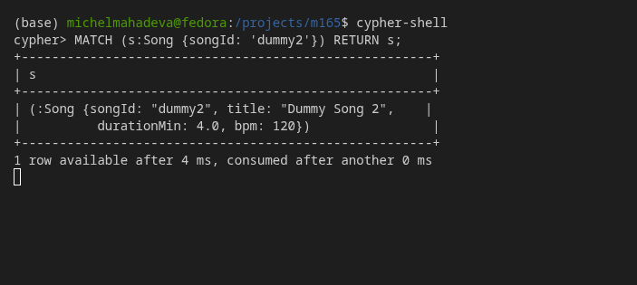
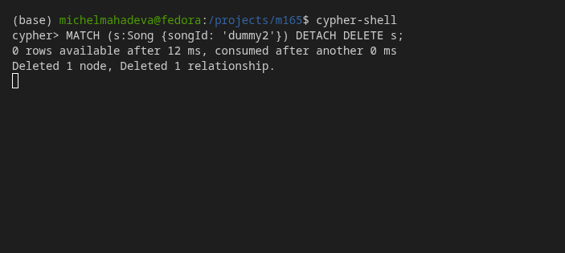
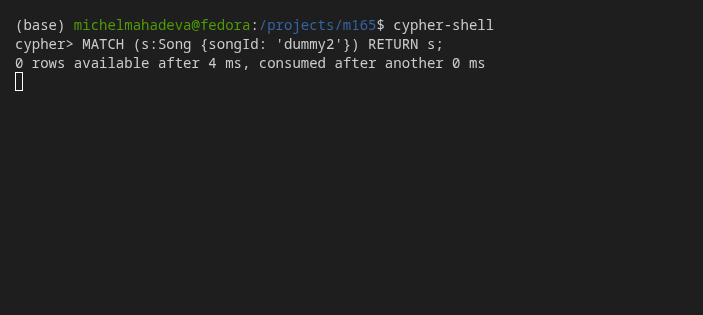
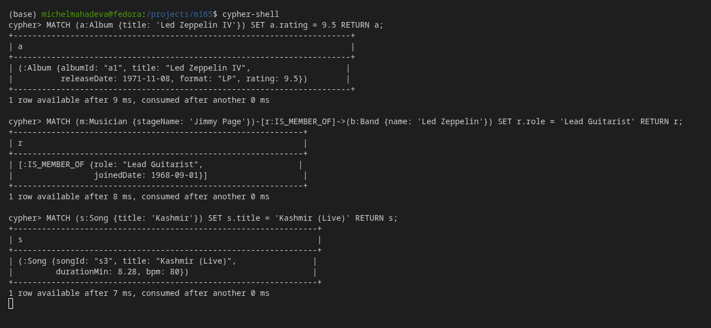
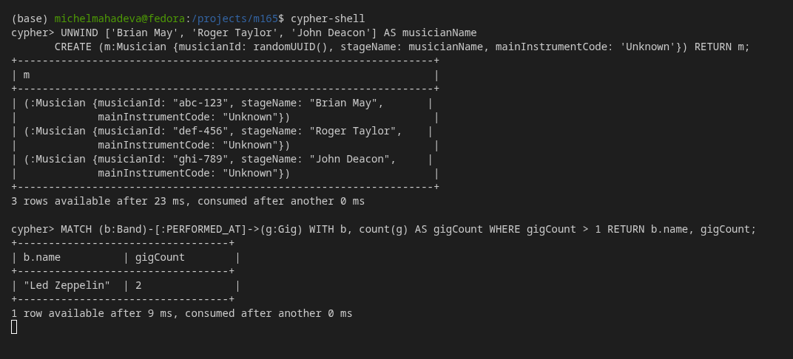

# KN-N-02: Datenabfrage und -Manipulation in Neo4j

## A) Daten hinzufügen

Für die initialen Daten wurde ein einzelnes, umfangreiches `CREATE`-Statement verwendet, welches mehrere Musiker, Bands, Songs, Alben, Auftritte (Gigs) und deren Beziehungen zueinander erstellt. Die Daten basieren auf dem Band-Projekt aus den vorherigen Modulen (KN-M-03, KN-N-01).

### Cypher-Statement

```cypher
CREATE 
  (m1:Musician {musicianId: 'm1', stageName: 'Jimmy Page', mainInstrumentCode: 'G', email: 'jimmy.page@ledzeppelin.com'}),
  (m2:Musician {musicianId: 'm2', stageName: 'Robert Plant', mainInstrumentCode: 'V', email: 'robert.plant@ledzeppelin.com'}),
  (m3:Musician {musicianId: 'm3', stageName: 'John Paul Jones', mainInstrumentCode: 'B', email: 'jpj@ledzeppelin.com'}),
  (m4:Musician {musicianId: 'm4', stageName: 'John Bonham', mainInstrumentCode: 'D', email: 'bonzo@ledzeppelin.com'}),
  (m5:Musician {musicianId: 'm5', stageName: 'Freddie Mercury', mainInstrumentCode: 'V', email: 'freddie@queen.com'}),
  
  (b1:Band {bandId: 'b1', name: 'Led Zeppelin', formedDate: date('1968-09-01'), genre: 'Hard Rock'}),
  (b2:Band {bandId: 'b2', name: 'Queen', formedDate: date('1970-06-01'), genre: 'Rock'}),
  (b3:Band {bandId: 'b3', name: 'The Who', formedDate: date('1964-01-01'), genre: 'Rock'}),
  
  (s1:Song {songId: 's1', title: 'Stairway to Heaven', durationMin: 8.02, bpm: 73}),
  (s2:Song {songId: 's2', title: 'Whole Lotta Love', durationMin: 5.34, bpm: 90}),
  (s3:Song {songId: 's3', title: 'Kashmir', durationMin: 8.28, bpm: 80}),
  (s4:Song {songId: 's4', title: 'Bohemian Rhapsody', durationMin: 5.55, bpm: 72}),
  (s5:Song {songId: 's5', title: 'Another One Bites the Dust', durationMin: 3.35, bpm: 110}),
  (s6:Song {songId: 's6', title: 'We Will Rock You', durationMin: 2.01, bpm: 81}),
  
  (a1:Album {albumId: 'a1', title: 'Led Zeppelin IV', releaseDate: date('1971-11-08'), format: 'LP'}),
  (a2:Album {albumId: 'a2', title: 'Led Zeppelin II', releaseDate: date('1969-10-22'), format: 'LP'}),
  (a3:Album {albumId: 'a3', title: 'A Night at the Opera', releaseDate: date('1975-11-21'), format: 'LP'}),
  (a4:Album {albumId: 'a4', title: 'The Game', releaseDate: date('1980-06-30'), format: 'LP'}),
  
  (g1:Gig {gigId: 'g1', venue: 'Madison Square Garden', date: date('1973-07-27'), ticketPrice: 7.50}),
  (g2:Gig {gigId: 'g2', venue: 'Wembley Stadium', date: date('1986-07-12'), ticketPrice: 14.50}),
  (g3:Gig {gigId: 'g3', venue: 'Royal Albert Hall', date: date('1970-01-09'), ticketPrice: 3.00}),
  
  (m1)-[:IS_MEMBER_OF {role: 'Guitarist', joinedDate: date('1968-09-01')}]->(b1),
  (m2)-[:IS_MEMBER_OF {role: 'Vocalist', joinedDate: date('1968-09-01')}]->(b1),
  (m3)-[:IS_MEMBER_OF {role: 'Bassist', joinedDate: date('1968-09-01')}]->(b1),
  (m4)-[:IS_MEMBER_OF {role: 'Drummer', joinedDate: date('1968-09-01')}]->(b1),
  (m5)-[:IS_MEMBER_OF {role: 'Lead Vocalist', joinedDate: date('1970-06-01')}]->(b2),
  
  (s1)-[:PERFORMED_BY]->(b1),
  (s2)-[:PERFORMED_BY]->(b1),
  (s3)-[:PERFORMED_BY]->(b1),
  (s4)-[:PERFORMED_BY]->(b2),
  (s5)-[:PERFORMED_BY]->(b2),
  (s6)-[:PERFORMED_BY]->(b2),
  
  (a1)-[:INCLUDES {trackNo: 4, isBonus: false}]->(s1),
  (a2)-[:INCLUDES {trackNo: 1, isBonus: false}]->(s2),
  (a3)-[:INCLUDES {trackNo: 11, isBonus: false}]->(s4),
  (a4)-[:INCLUDES {trackNo: 3, isBonus: false}]->(s5),
  
  (b1)-[:PERFORMED_AT]->(g1),
  (b1)-[:PERFORMED_AT]->(g3),
  (b2)-[:PERFORMED_AT]->(g2);
```

### Ausführung (Screenshot)



---

## B) Daten abfragen

### Theoretische Frage: `OPTIONAL MATCH`

**Die Fragestellung:** In der Theorie haben Sie ein Statement gesehen, um alle Knoten und Kanten zu lesen (`MATCH (n) OPTIONAL MATCH (n)-[r]->(m) RETURN n,r,m`). Erklären Sie das Statement im Detail, speziell auch die `OPTIONAL MATCH` Klausel.

**Erklärung:**
Das Statement zielt darauf ab, den vollständigen Inhalt der Datenbank abzurufen, unabhängig davon, ob Beziehungen existieren oder nicht.
- `MATCH (n)`: Sucht zunächst nach allen Knoten in der Datenbank und weist sie der Variablen `n` zu.
- `OPTIONAL MATCH (n)-[r]->(m)`: Dies ist das Äquivalent zu einem `LEFT OUTER JOIN` in SQL. Es sucht nach ausgehenden Beziehungen `r` von dem Knoten `n` zu einem Zielknoten `m`. Wenn für einen Knoten `n` keine solche Beziehung existiert, gibt Cypher nicht einfach ein leeres Ergebnis für `n` zurück. Stattdessen bleibt `n` erhalten, während `r` und `m` mit `null` (also "leer") gefüllt werden.
- `RETURN n, r, m`: Gibt alle gefundenen Knoten, Beziehungen und Zielknoten zurück. Ohne `OPTIONAL MATCH` (also nur `MATCH (n)-[r]->(m)`) würden isolierte Knoten ohne jegliche Kanten im Ergebnis komplett fehlen.

### Szenarien zur Datenabfrage

**Szenario 1:** Wir möchten herausfinden, welche Musiker Mitglieder der Band "Led Zeppelin" sind.
```cypher
MATCH (m:Musician)-[:IS_MEMBER_OF]->(b:Band) 
WHERE b.name = 'Led Zeppelin' 
RETURN m.stageName, m.mainInstrumentCode;
```

**Szenario 2:** Wir suchen nach allen Songs in der Datenbank, die länger als 6 Minuten dauern (Verwendung der `WHERE`-Klausel für numerische Filterung).
```cypher
MATCH (s:Song) 
WHERE s.durationMin > 6 
RETURN s.title, s.durationMin;
```

**Szenario 3:** Wir suchen nach den Rollen aller Musiker, die in Bands des Genres "Rock" spielen (Filtern von Eigenschaften auf Zielknoten und Ausgabe von Beziehungsattributen).
```cypher
MATCH (m:Musician)-[r:IS_MEMBER_OF]->(b:Band) 
WHERE b.genre = 'Rock' 
RETURN m.stageName, r.role, b.name;
```

**Szenario 4:** Wir möchten alle Alben auflisten, deren Titel mit dem Artikel "The" beginnt.
```cypher
MATCH (a:Album) 
WHERE a.title STARTS WITH 'The' 
RETURN a.title, a.releaseDate;
```

### Ausführung (Screenshot)



---

## C) Daten löschen

Die Klausel `DETACH DELETE` löscht nicht nur den angegebenen Knoten, sondern **zwingend auch alle damit verbundenen Beziehungen (Kanten)**. Wird nur `DELETE` auf einem Knoten verwendet, der noch über Beziehungen verfügt, bricht die Datenbank die Transaktion mit einer Fehlermeldung ab, um inkonsistente Zustände (sogenannte "Dangling Edges") zu vermeiden.

### Vorbereitung (Testdaten)
Für diesen Test wurden zuvor zwei Dummy-Songs und Dummy-Bands inklusive Beziehungen erstellt.

### Test 1: Löschen OHNE `DETACH`

**Vorher (Ausgangslage):**


**Statement & Fehlgeschlagene Ausführung:**
Wir versuchen, den Song-Knoten zu löschen, ohne die bestehende `PERFORMED_BY`-Beziehung zu entfernen. Dies löst einen Fehler aus.
```cypher
MATCH (s:Song {songId: 'dummy1'}) DELETE s;
```


**Nachher:**
Wie erwartet, existiert der Knoten weiterhin, da die Datenbank die Löschung verweigert hat.


### Test 2: Löschen MIT `DETACH`

**Vorher (Ausgangslage):**


**Statement & Erfolgreiche Ausführung:**
Wir verwenden nun `DETACH DELETE`. Die Datenbank löscht zuerst die Beziehung (`PERFORMED_BY`) und anschliessend den Knoten.
```cypher
MATCH (s:Song {songId: 'dummy2'}) DETACH DELETE s;
```


**Nachher:**
Der Knoten und die zugehörigen Beziehungen wurden erfolgreich und restlos aus der Datenbank entfernt.


---

## D) Daten verändern

Wir aktualisieren die bestehenden Datensätze anhand von drei spezifischen Anwendungsfällen.

**Szenario 1:** Dem Album "Led Zeppelin IV" soll nachträglich ein neues Attribut `rating` hinzugefügt werden, um eine Bewertung darzustellen.
```cypher
MATCH (a:Album {title: 'Led Zeppelin IV'}) 
SET a.rating = 9.5 
RETURN a;
```

**Szenario 2:** Bei der `IS_MEMBER_OF`-Beziehung zwischen Jimmy Page und Led Zeppelin soll die Eigenschaft `role` aktualisiert werden, um präzise auf "Lead Guitarist" zu verweisen. Dies demonstriert das Verändern von Eigenschaften auf Kanten (Beziehungen).
```cypher
MATCH (m:Musician {stageName: 'Jimmy Page'})-[r:IS_MEMBER_OF]->(b:Band {name: 'Led Zeppelin'}) 
SET r.role = 'Lead Guitarist' 
RETURN r;
```

**Szenario 3:** Der Titel des Songs "Kashmir" soll zu "Kashmir (Live)" umbenannt werden.
```cypher
MATCH (s:Song {title: 'Kashmir'}) 
SET s.title = 'Kashmir (Live)' 
RETURN s;
```

### Ausführung (Screenshot)



---

## E) Zusätzliche Klauseln

Wir beleuchten zwei weitere, leistungsstarke Cypher-Klauseln: `UNWIND` und `WITH` (inkl. der Aggregationsfunktion `count()`).

### 1. `UNWIND`
Die `UNWIND`-Klausel dekonstruiert eine Liste (Array) in einzelne Werte (Zeilen). Dies ist besonders nützlich, wenn man Arrays aus externen Quellen erhält und für jedes Element der Liste eine Operation (wie z.B. einen `CREATE`-Befehl) ausführen möchte.

**Szenario:** Wir möchten in einem einzigen Durchlauf drei neue Musiker (weitere Queen-Mitglieder) hinzufügen, deren Namen uns als kompakte Liste vorliegen.
```cypher
UNWIND ['Brian May', 'Roger Taylor', 'John Deacon'] AS musicianName
CREATE (m:Musician {musicianId: randomUUID(), stageName: musicianName, mainInstrumentCode: 'Unknown'}) 
RETURN m;
```

### 2. `WITH` (inklusive Aggregation)
Die `WITH`-Klausel fungiert wie ein Pipe-Operator oder ein temporäres `RETURN` innerhalb einer laufenden Abfrage. Sie erlaubt es, Variablen an den nächsten Teil der Query weiterzugeben, Zwischenergebnisse zu berechnen, zu aggregieren (z.B. zu zählen) oder zu sortieren, bevor die eigentliche Filterung (`WHERE`) oder Rückgabe (`RETURN`) stattfindet.

**Szenario:** Wir möchten alle Bands finden, die **mehr als einen** Auftritt (Gig) absolviert haben. Wir zählen (`count(g)`) die Auftritte pro Band und geben das Zwischenergebnis (`gigCount`) mit `WITH` weiter, um im Anschluss mit `WHERE gigCount > 1` danach filtern zu können.
```cypher
MATCH (b:Band)-[:PERFORMED_AT]->(g:Gig) 
WITH b, count(g) AS gigCount 
WHERE gigCount > 1 
RETURN b.name, gigCount;
```

### Ausführung (Screenshot)


