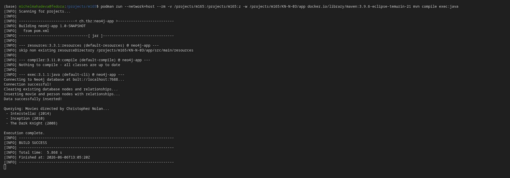
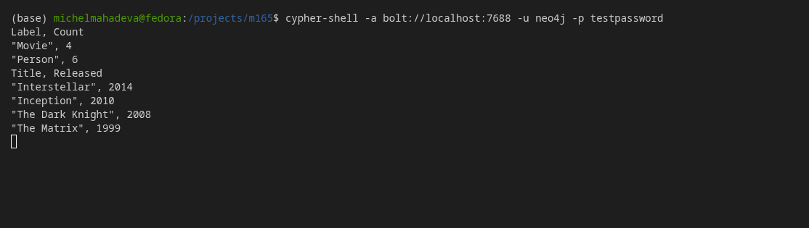

# KN-N-03: Programmierung mit Neo4j (Java Client)

## 1. Projektstruktur & Setup

Für das Projekt wurde ein strukturiertes Maven-Projekt in Java 21 erstellt.

### Dateibaum des Projekts:
```text
KN-N-03/
├── app/
│   ├── pom.xml
│   └── src/
│       └── main/
│           └── java/
│               └── ch/
│                   └── tbz/
│                       └── kn03/
│                           └── Neo4jApp.java
└── screenshots/
    ├── 01_java_run.png
    └── 02_neo4j_verify.png
```

### Maven Konfiguration (`pom.xml`)
In der `pom.xml` ist die offizielle Neo4j Java Driver Dependency (`neo4j-java-driver`) eingebunden:

```xml
<dependency>
    <groupId>org.neo4j.driver</groupId>
    <artifactId>neo4j-java-driver</artifactId>
    <version>5.18.0</version>
</dependency>
```

---

## 2. Java-Implementierung (`Neo4jApp.java`)

Das Java-Programm verbindet sich über das `bolt`-Protokoll mit der Neo4j-Instanz auf Port `7688` (mit Benutzer `neo4j` und Passwort `testpassword`), löscht bestehende Daten und fügt ein zusammenhängendes Netzwerk von Filmen, Personen und deren Beziehungen (ACTED_IN, DIRECTED) ein. Danach listet es alle Filme auf, bei denen Christopher Nolan Regie geführt hat.

```java
package ch.tbz.kn03;

import org.neo4j.driver.AuthTokens;
import org.neo4j.driver.Driver;
import org.neo4j.driver.GraphDatabase;
import org.neo4j.driver.Record;
import org.neo4j.driver.Result;
import org.neo4j.driver.Session;

public class Neo4jApp {

    private static final String URI = "bolt://localhost:7688";
    private static final String USER = "neo4j";
    private static final String PASSWORD = "testpassword";

    public static void main(String[] args) {
        System.out.println("Connecting to Neo4j database at " + URI + "...");
        
        try (Driver driver = GraphDatabase.driver(URI, AuthTokens.basic(USER, PASSWORD))) {
            
            // Verbindung verifizieren
            driver.verifyConnectivity();
            System.out.println("Connection successful!");

            try (Session session = driver.session()) {
                
                // 1. Bestehende Knoten und Beziehungen löschen (Clean State)
                System.out.println("Clearing existing database nodes and relationships...");
                session.executeWrite(tx -> {
                    tx.run("MATCH (n) DETACH DELETE n");
                    return null;
                });

                // 2. Testdaten einfügen
                System.out.println("Inserting movie and person nodes with relationships...");
                session.executeWrite(tx -> {
                    String createQuery = 
                        "CREATE " +
                        "  (m1:Movie {title: 'The Matrix', released: 1999, tagline: 'Welcome to the Real World'}), " +
                        "  (m2:Movie {title: 'Inception', released: 2010, tagline: 'Your mind is the scene of the crime'}), " +
                        "  (m3:Movie {title: 'Interstellar', released: 2014, tagline: 'Mankind was born on Earth. It was never meant to die here.'}), " +
                        "  (m4:Movie {title: 'The Dark Knight', released: 2008, tagline: 'Why So Serious?'}), " +
                        "   " +
                        "  (p1:Person {name: 'Keanu Reeves', born: 1964}), " +
                        "  (p2:Person {name: 'Carrie-Anne Moss', born: 1967}), " +
                        "  (p3:Person {name: 'Leonardo DiCaprio', born: 1974}), " +
                        "  (p4:Person {name: 'Matthew McConaughey', born: 1969}), " +
                        "  (p5:Person {name: 'Christopher Nolan', born: 1970}), " +
                        "  (p6:Person {name: 'Christian Bale', born: 1974}), " +
                        "   " +
                        "  (p1)-[:ACTED_IN {roles: ['Neo']}]->(m1), " +
                        "  (p2)-[:ACTED_IN {roles: ['Trinity']}]->(m1), " +
                        "  (p3)-[:ACTED_IN {roles: ['Cobb']}]->(m2), " +
                        "  (p5)-[:DIRECTED]->(m2), " +
                        "  (p4)-[:ACTED_IN {roles: ['Cooper']}]->(m3), " +
                        "  (p5)-[:DIRECTED]->(m3), " +
                        "  (p6)-[:ACTED_IN {roles: ['Bruce Wayne']}]->(m4), " +
                        "  (p5)-[:DIRECTED]->(m4)";
                    tx.run(createQuery);
                    return null;
                });
                System.out.println("Data successfully inserted!");

                // 3. Daten abfragen (Filme von Christopher Nolan)
                System.out.println("\nQuerying: Movies directed by Christopher Nolan...");
                session.executeRead(tx -> {
                    Result result = tx.run(
                        "MATCH (p:Person {name: 'Christopher Nolan'})-[:DIRECTED]->(m:Movie) " +
                        "RETURN m.title AS title, m.released AS released " +
                        "ORDER BY m.released DESC"
                    );
                    
                    while (result.hasNext()) {
                        Record record = result.next();
                        String title = record.get("title").asString();
                        int released = record.get("released").asInt();
                        System.out.printf(" - %s (%d)\n", title, released);
                    }
                    return null;
                });
            }
            
        } catch (Exception e) {
            System.err.println("An error occurred during database operations:");
            e.printStackTrace();
        }
        
        System.out.println("\nExecution complete.");
    }
}
```

---

## 3. Ausführung & Validierung

### Screenshot 1: Ausführung des Java-Programms
Das Programm wurde über Maven innerhalb einer JDK-Laufzeitumgebung ausgeführt:



### Screenshot 2: Verifizierung in der Graphdatenbank
Nach Ausführung des Programms wurden die Knotenzahlen und Inhalte direkt über `cypher-shell` verifiziert:



---

## 4. Theorie-Fragen (Connection Strings & Protokolle)

### Connection Strings allgemein
Ein **Connection String** (Verbindungszeichenfolge) ist eine standardisierte URI-Struktur (Uniform Resource Identifier), die Client-Bibliotheken alle notwendigen Konfigurationsparameter bereitstellt, um eine Netzwerkverbindung zu einem Datenbankserver aufzubauen. Er enthält mindestens:
- Das **Protokoll / Schema** (z. B. `mongodb://`, `bolt://`)
- Optionale **Authentifizierungsdaten** (Username & Passwort)
- Den **Hostnamen** bzw. die IP-Adresse und den **Port** des Servers
- Optionale Pfadangaben (z. B. die Standard-Datenbank) sowie weitere **Query-Parameter** (z. B. SSL/TLS-Optionen, Timeout-Einstellungen oder Authentifizierungsquellen).

---

### Was bewirkt `authSource=admin` im MongoDB-Kontext?
In MongoDB ist die Benutzerverwaltung dezentral organisiert. Benutzerkonten werden innerhalb bestimmter logischer Datenbanken angelegt. Wenn sich ein Client authentifiziert, muss MongoDB wissen, in welcher Datenbank die Benutzerdaten und Berechtigungsrollen dieses Benutzers gespeichert sind.

- Der Parameter `authSource=admin` legt fest, dass MongoDB den übergebenen Benutzernamen in der administrativen Datenbank **`admin`** suchen soll, um das Passwort und die Berechtigungen abzugleichen.
- Dies ist vor allem dann wichtig, wenn der Benutzer Administrationsrechte besitzt oder übergreifenden Zugriff auf mehrere Anwendungsdatenbanken benötigt (z. B. ein Superuser), aber Daten in einer anderen Datenbank liest/schreibt.
- Falls `authSource` nicht definiert ist, nimmt MongoDB standardmäßig die in der Verbindungs-URI angegebene Zieldatenbank als Authentifizierungsdatenbank an, was bei administrativen Benutzern zu Authentifizierungsfehlern führen kann.
- *Referenz:* Offizielle MongoDB-Dokumentation: [MongoDB Connection String Options - authSource](https://www.mongodb.com/docs/manual/reference/connection-string/#mongodb-urioption-urioption.authSource)

---

### Die Neo4j Connection-URI (`bolt://localhost:7688`)
In unserem Projekt wird die URI `bolt://localhost:7688` zur Verbindung mit Neo4j verwendet. Die einzelnen Komponenten bedeuten:

1. **`bolt://`**: 
   - Das **Bolt-Protokoll** ist ein von Neo4j entwickeltes, binäres Protokoll, das speziell für Graphdatenbanksysteme entworfen wurde. Es ist hochperformant, verbindungsorientiert und serialisiert Graphdaten äusserst effizient über TCP.
   - Neben `bolt://` gibt es auch `neo4j://` (welches automatische Routing-Funktionalitäten in Clustern unterstützt).
2. **`localhost`**: 
   - Der Host-Name, der darauf hinweist, dass der Datenbankserver auf derselben Maschine läuft wie das Client-Programm (Loopback-Adresse `127.0.0.1`).
3. **`7688`**: 
   - Der spezifische TCP-Port, auf dem der Bolt-Server der containerisierten Neo4j-Instanz lauscht. Standardmässig lauscht Bolt auf Port `7687`, hier wurde er jedoch auf `7688` konfiguriert, um Konflikte mit dem lokalen Host-Daemon zu vermeiden.
- *Referenz:* Offizielle Neo4j-Dokumentation: [Neo4j Connection URIs & Protocols](https://neo4j.com/docs/operations-manual/current/configuration/connectors/)
